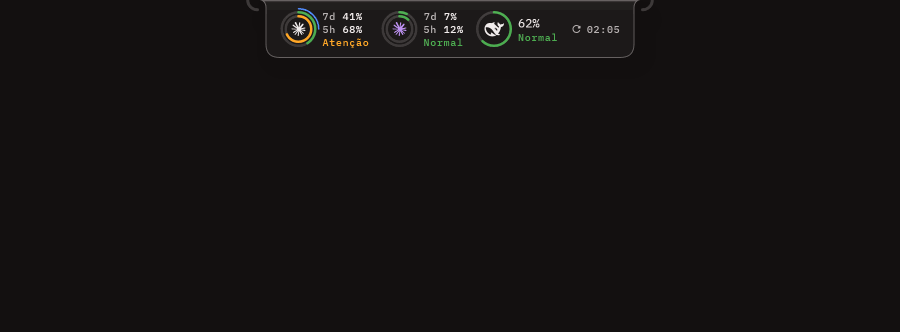
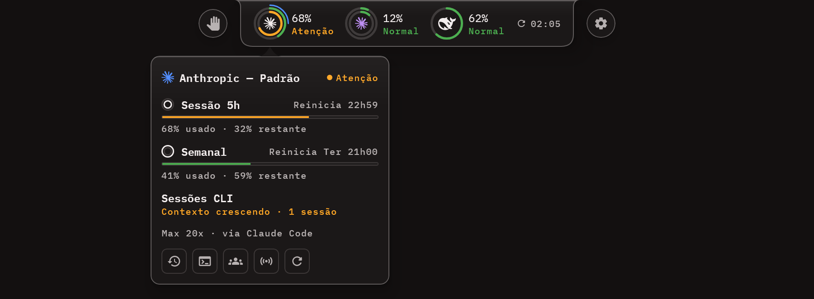
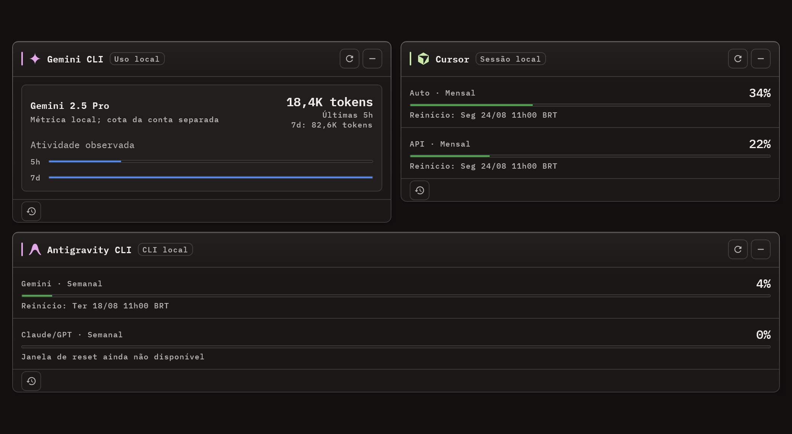

# Usage Monitor

**One desktop panel for the usage, quotas and cost of every AI coding tool you pay for.**

[](https://github.com/edilsonvilarinho/usage-monitor/actions/workflows/ci.yml)
[](https://github.com/edilsonvilarinho/usage-monitor/releases/latest)


[](LICENSE)

English · [Português (Brasil)](README.pt-BR.md)



Usage Monitor watches eleven integrations at once — Claude Code, Codex, MiniMax, DeepSeek, OpenCode
Zen Free, OpenCode Go, Kilo Free, OpenRouter, Gemini CLI, Cursor and Antigravity CLI — and shows
their available usage metrics on a single screen. It also reads your **local Claude Code transcripts**
to break down cost per session, project, branch and model, keeps history in SQLite for trends and
forecasts, and can push aggregated usage to a team server you host yourself.

It is a desktop app for Windows, Linux and macOS. It reads credentials you already have; it never
sends prompt or response content anywhere.

## Quick start

1. **Download** the installer for your system from the
   [latest release](https://github.com/edilsonvilarinho/usage-monitor/releases/latest):
   - Windows: `UsageMonitor-Setup-X.Y.Z.exe`
   - Linux: `install-usage-monitor_X.Y.Z_linux_x64.sh` (or the `.deb` / `.rpm`)
   - macOS: the `.dmg` for Apple silicon or Intel

   [Installation](#installation) has the details for each system.
2. **Open it.** Claude Code and Codex are found on their own. Turn on the integrations you use in
   **Settings > APIs**.
3. **Keep working.** After the first collection a fresh install moves to the **HUD strip**, a small
   notch docked to the top of the screen. Hover a ring to see details. `Ctrl+Shift+H` brings the full
   window back.

## The HUD strip



The HUD strip is a notch docked to any edge of any monitor. It stays on top of other windows and
takes almost no screen space.

- **One ring per account, one arc per quota.** The outer ring is the longest window (weekly) and the
  inner ring the shortest (5h). Next to the ring are the percentage of the quota closest to running out
  and the status word. A quota without a forecast has a dashed track.
- **Hover a ring** to open that account's balloon. It shows each quota with its bar, how much is used
  and left, and when it resets. It also shows the plan, where the reading came from, and the same
  buttons as the card: history, CLI sessions and team. A small glyph next to each quota shows which
  ring is which. Click a ring to refresh that account.
- **CLI session signals.** The balloon lists Claude Code sessions whose context is growing or
  saturated, and sessions with no reply since the last request, for that account only.
- **One colour per Claude account.** Pick it in **Settings > Accounts**. The colour appears on the
  cards and in the HUD, so two accounts on the same PC are easy to tell apart.
- A thin arc orbits the ring while a Claude Code or Codex session was active in the last 5 minutes.
- **Switching modes.** You can switch between the standard window, cards only and the HUD strip from
  any of these:
  - the footer menu
  - the gear at the end of the notch
  - the tray menu
  - `Ctrl+Shift+H` (HUD strip) or `Ctrl+Shift+M` (cards only)

  Drag the hand at the end of the notch to move it. It snaps to the nearest edge of the monitor you
  drop it on.


## Why Usage Monitor

- **Quotas at a glance.** The HUD strip shows every account's windows without opening a window. The
  tray alerts you when a quota crosses 75/90/100%.
- **Cost per session.** Your local Claude Code transcripts are broken down by session, project,
  branch and model, with estimated cost and a context health verdict. See
  [the sessions screen](#screenshots).
- **History and forecast.** Local history shows trends and a projection of when a quota runs out,
  and compares each period with the previous one.
- **Team view.** An optional self-hosted server aggregates one account across machines, with a
  30-day trend and live presence.

## Features

- **HUD strip and window modes** — the notch described above, plus a cards-only window with no title
  bar or footer. A fresh install moves to the HUD strip after its first collection. Anyone already
  using the app keeps the mode they had.
- **Unified dashboard** — one card per source, auto-refresh every 10 minutes, manual refresh per
  integration, reorderable and collapsible cards. If one source fails the others keep working.
- **Claude Code session costs** — one row per session, read from local transcripts, with estimated
  cost, a session health verdict and live updates.
- **Codex CLI local sessions** — session and response token summaries from local rollouts, with
  model/project filters, detail, refresh and CSV/JSON export. No USD cost is inferred.
- **Usage breakdown** — the same window sliced by project, model, branch and tool, with burn rate in
  USD/h and tokens/h, a weekday × hour activity grid, and active time that discards gaps longer than
  five minutes.
- **History and forecast** — local SQLite history with trend, hourly average, projected exhaustion,
  previous-period comparison and a monthly USD budget.
- **Alerts** — tray icon with a risk dot, plus native notifications when a quota crosses 75/90/100%
  or a session saturates. Thresholds and quiet hours are configurable.
- **Export** — CSV and JSON of sessions and summaries, and a PDF report of whatever is on screen.
- **Team view (optional)** — a self-hosted server aggregates the same account across machines, with a
  30-day per-member trend and a live presence list.
- **Desktop behaviour** — auto-start on all three platforms, light and dark themes, English and
  Portuguese, UI scale from 80% to 150%, adjustable window opacity, and self-update on Windows and
  Linux.
- **In-app help** — twelve topics covering what each feature does, how to turn it on, and an animated
  demo of it. Opens from the footer icon, the tray menu or `F1`.

## Supported integrations

| Integration | Type | Data source | Local requirement |
|---|---|---|---|
| Anthropic | Remote | `GET /api/oauth/usage` | `~/.claude/.credentials.json` |
| Codex | Remote | `GET /backend-api/wham/usage` | `~/.codex/auth.json` and `~/.codex/cap_sid` |
| Codex CLI sessions | Local | reads `<CODEX_HOME>/sessions/**/*.jsonl` | local Codex CLI rollouts; authentication not required |
| MiniMax | Remote | `GET /v1/token_plan/remains` | API key, entered in **Settings > APIs** |
| DeepSeek | Remote | `GET /user/balance` | API key, entered in **Settings > APIs** |
| OpenCode Zen Free | Local | reads `~/.local/share/opencode/opencode.db` | an existing OpenCode database |
| OpenCode Go | Remote | `GET /zen/go/v1/usage` | API key, entered in **Settings > APIs** |
| Kilo Free | Local | reads `~/.local/share/kilo/kilo.db` | an existing Kilo database |
| OpenRouter | Remote | `GET /api/v1/credits` | API key, entered in **Settings > APIs** |
| Gemini CLI | Local | reads `~/.gemini/tmp/*/chats/*.jsonl` | local Gemini CLI session history; token activity only |
| Cursor | Remote | `GET https://cursor.com/api/usage-summary` | an existing signed-in Cursor editor session; undocumented personal route |
| Antigravity CLI | Local | `agy --print /usage` (answered by the CLI itself, no model turn) | Antigravity CLI 1.2.9+ installed and already authenticated |

Full endpoints, credential paths and per-integration limits:
[`docs/integrations.md`](docs/integrations.md).

## Screenshots


One card per account or integration. The Anthropic card shows all three quotas — 5-hour session,
weekly, and usage credits — with a risk indicator on whichever one is in danger.

The additional local and CLI sources keep observed tokens, Cursor's personal usage summary, and
Antigravity's per-model-group quotas distinct:




One row per Claude Code session, with a health verdict, estimated cost and window filters. The header
counts how many sessions are saturated or need attention.


Usage aggregated per team member: alias, machine, tokens, cost and share of the team. Each member
expands to their own sessions.

<details>
<summary>More screens</summary>

**History and forecast** — consumption over the range, with window resets marked, hourly average and
projected exhaustion.


**Usage breakdown** — the same window sliced by project, model, branch and tool, with burn rate and
the activity grid. The lists describe the same turns, so adding buckets from different lists would
count the same spend three times.


**Session detail** — a `/compact` recommendation, context growth turn by turn and, under Advanced,
token composition, cost distribution and cache savings.


**Team trend** — what each member spent per day, one bar per day and one colour per person, all on a
single scale.


**Live presence** — who has the app open and who is actually running Claude Code right now, as two
separate states.


Administrators see the same screen across every account:


**Settings**, with side navigation instead of one long column of cards.


**Themes** — every screen is drawn in both, from the same tokens.


</details>

Screenshots are rendered offscreen from the app's own components with synthetic data. No real
account, machine or key appears in them. The help window's demos come from the same engine
(`gradlew.bat generateHelpMedia`) and ship inside the installer, under
`src/desktopMain/resources/help/`.

## Installation

**[Download the latest release →](https://github.com/edilsonvilarinho/usage-monitor/releases/latest)**

| Platform | Artifact | Install | Self-updating |
|---|---|---|---|
| Windows | `UsageMonitor-Setup-X.Y.Z.exe` | run it — per-user, no admin rights | **Yes** |
| Linux | `install-usage-monitor_X.Y.Z_linux_x64.sh` | `sh ./install-usage-monitor_X.Y.Z_linux_x64.sh`, no `sudo` | **Yes** |
| Linux | `usage-monitor_X.Y.Z_amd64.deb` | `sudo apt install ./usage-monitor_X.Y.Z_amd64.deb` | No |
| Linux | `usage-monitor-X.Y.Z.x86_64.rpm` | `sudo dnf install ./usage-monitor-X.Y.Z.x86_64.rpm` | No |
| macOS (Apple silicon) | `usage-monitor_X.Y.Z_macos_arm64.dmg` | open, drag to Applications | No |
| macOS (Intel) | `usage-monitor_X.Y.Z_macos_x64.dmg` | open, drag to Applications | No |

The `.exe` and the `.sh` are the only paths that can update themselves. Prefer them.

<details>
<summary>Windows — migrating from the old MSI</summary>

Until v37 the release also published a `Usage Monitor-X.Y.Z.msi`, and both installers wrote to the
same `%LOCALAPPDATA%\Usage Monitor`. The MSI was dropped because anyone installed through it was
permanently locked out of auto-update.

**If you are on an MSI install, you do not need to do anything.** Download `UsageMonitor-Setup` and
run it: it finds the previous MSI product by its UpgradeCode, removes it silently, and only then
writes the new version. Your data lives in `~/.usage-monitor/` and in the registry preferences,
outside the install directory, and survives the migration.

If the automatic removal fails, the installer says so and stops rather than producing a double
install. Manual cleanup:

1. Close Usage Monitor.
2. Uninstall the MSI from *Apps & features* — the entry whose uninstaller is `MsiExec.exe` — or run
   `msiexec /x {ProductCode}`.
3. Delete the orphaned uninstall key, if it is still there:
   `reg delete "HKCU\Software\Microsoft\Windows\CurrentVersion\Uninstall\Usage Monitor" /f`
4. Check that `%LOCALAPPDATA%\Usage Monitor` is gone; delete it if not.
5. Install `UsageMonitor-Setup-X.Y.Z.exe`.
6. Re-check *Start with Windows* in Settings.

</details>

<details>
<summary>Linux — what the user-space installer does</summary>

The `.sh` installer downloads the release tarball (or uses a local copy sitting next to it),
**always verifies the SHA-256**, and builds the whole tree inside `$HOME`:

```
<XDG_DATA_HOME>/usage-monitor/versions/<version>/   one tree per retained version
<XDG_DATA_HOME>/usage-monitor/current               text file naming the active version
~/.local/bin/usage-monitor                          stable launcher
~/.local/share/applications/usage-monitor.desktop   menu entry
```

It **refuses to run** when it finds an existing `.deb`/`.rpm` install or an `/opt/usage-monitor` —
remove those first. If `~/.local/bin` is not on your `PATH` it warns you; the app is still reachable
by full path and from the menu entry.

Roughly 125 MB per version, and about 600 MB on disk once two versions are retained for rollback.
Not supported: musl/Alpine, ARM64, Flatpak and AppImage.

</details>

<details>
<summary>macOS — Gatekeeper on first launch</summary>

The DMGs are published **without an Apple signature**, so Gatekeeper blocks the first launch. Two
ways around it:

- Right-click the app inside `/Applications` and choose **Open**, then confirm.
- Or clear the quarantine flag:
  `xattr -dr com.apple.quarantine "/Applications/Usage Monitor.app"`

Auto-start on macOS writes `~/Library/LaunchAgents/com.usagemonitor.app.plist` and loads the agent
with `launchctl`.

</details>

## First run

- **Claude Code and Codex need no setup.** Usage Monitor finds `~/.claude/.credentials.json` and
  `~/.codex/auth.json` on its own. Newly detected Anthropic profiles stay disabled until you confirm
  them, so nothing is collected behind your back.
- **MiniMax, DeepSeek, OpenCode Go and OpenRouter need an API key**, entered in **Settings > APIs**. Keys are
  stored in `~/.usage-monitor/api-keys.json` with an atomic write and owner-only permissions.
  Environment variables are never read.
- **OpenCode Zen Free and Kilo Free need nothing** — they read the local databases those tools
  already keep.
- History, the session index and diagnostics live in `~/.usage-monitor/`.
- Codex CLI session summaries use `~/.usage-monitor/codex-cli-history.db` and are read from
  `$CODEX_HOME/sessions` when `CODEX_HOME` is set, otherwise `~/.codex/sessions`.
- The Codex CLI local index stores only metadata and token counters. It does not store prompts,
  responses, reasoning text, tool inputs or credentials, and it never deletes the original rollouts.
- The dashboard refreshes every 10 minutes. Closing the window quits the app; there is no
  minimise-to-tray.

Endpoints, credential paths and per-integration limits: [`docs/integrations.md`](docs/integrations.md).

## Team view (optional)

Off by default. It covers the case where several developers share one Anthropic account across
different machines and the company wants to see aggregated usage.

Your company runs the server — there is no managed service. Each machine pushes its indexed turns
every 30 seconds and the server returns the aggregated view, per member and per account, with a
30-day trend and a live presence list. Setup, API contract and deployment: [`server/README.md`](server/README.md).


## Privacy

- Credential files are **read only**. Usage Monitor never runs a login or logout flow and never
  deletes them.
- **No prompt or response content is ever transmitted.** The team integration sends usage metadata
  only: session id, message id, timestamp, model, token counts, project directory, branch and machine
  name.
- Network traffic goes to the vendor APIs listed in [`docs/integrations.md`](docs/integrations.md)
  and, if you configure it, to **your own** team server. Nowhere else.
- The team key lives in `~/.usage-monitor/team.json` with owner-only permissions, deliberately kept
  out of the preference store, which is written in the clear.

## Requirements

Windows, Linux (x86_64) or macOS. The installers bundle their own Java runtime — nothing else to
install. A JDK is only needed to build from source.

## Documentation

| Document | What it covers |
|---|---|
| [`docs/integrations.md`](docs/integrations.md) | every source: endpoints, credentials, known limits |
| [`docs/architecture.md`](docs/architecture.md) | layers, source sets, dependency injection, storage |
| [`docs/build-and-release.md`](docs/build-and-release.md) | building, packaging, CI and auto-update |
| [`CONTRIBUTING.md`](CONTRIBUTING.md) | how to set up, test and submit a change |
| [`SECURITY.md`](SECURITY.md) | reporting a vulnerability, and how credentials are handled |
| [`server/README.md`](server/README.md) | the optional team server: API contract and deployment |
| [`CHANGELOG.md`](CHANGELOG.md) | release history |

Internal working notes, in Portuguese: [`docs/design-system/`](docs/design-system/readme.md) (visual
source of truth) and [`docs/planos/`](docs/planos/) (execution plans and decision records).

## Contributing

Issues and pull requests are welcome. Start with [`CONTRIBUTING.md`](CONTRIBUTING.md) — it covers the
build, the test suite and the code conventions. For anything security-related, read
[`SECURITY.md`](SECURITY.md) first.

## License

[MIT](LICENSE) © 2026 Edilson Vilarinho
