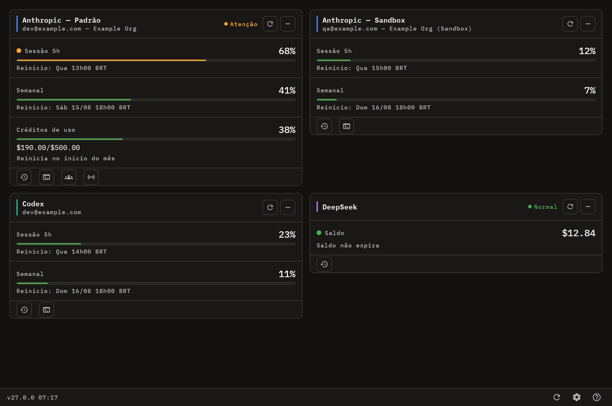
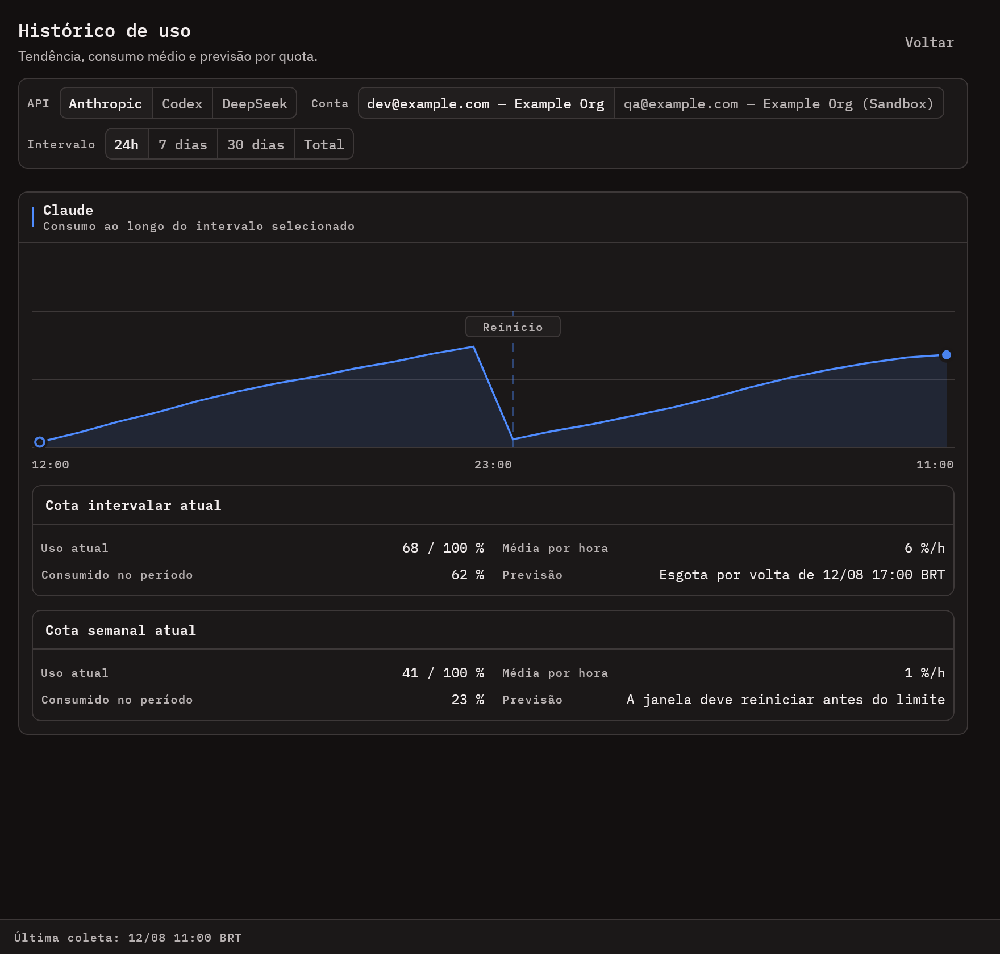
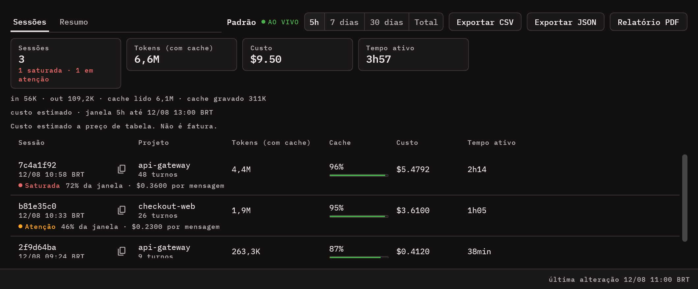
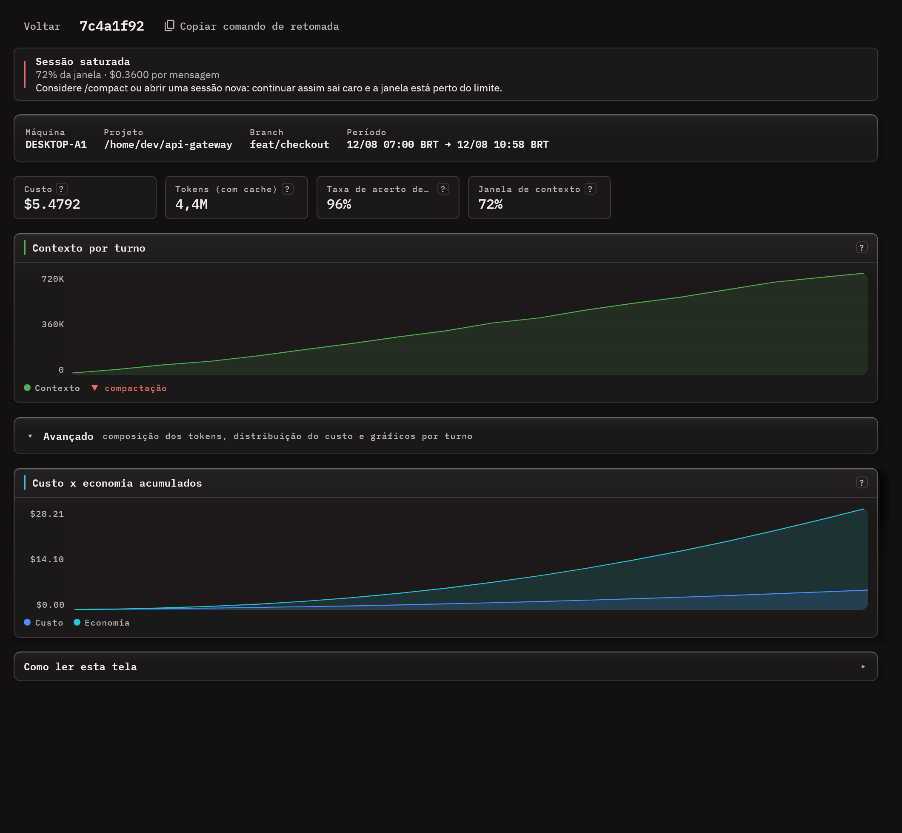
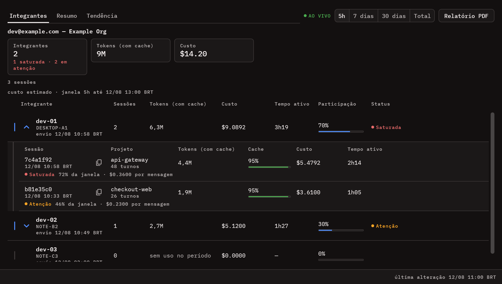
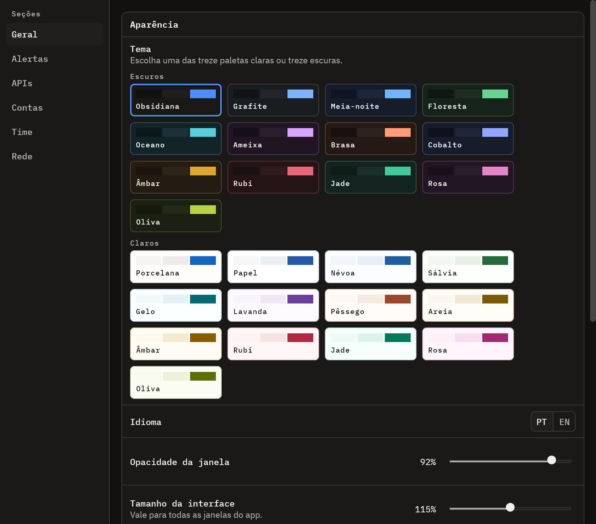
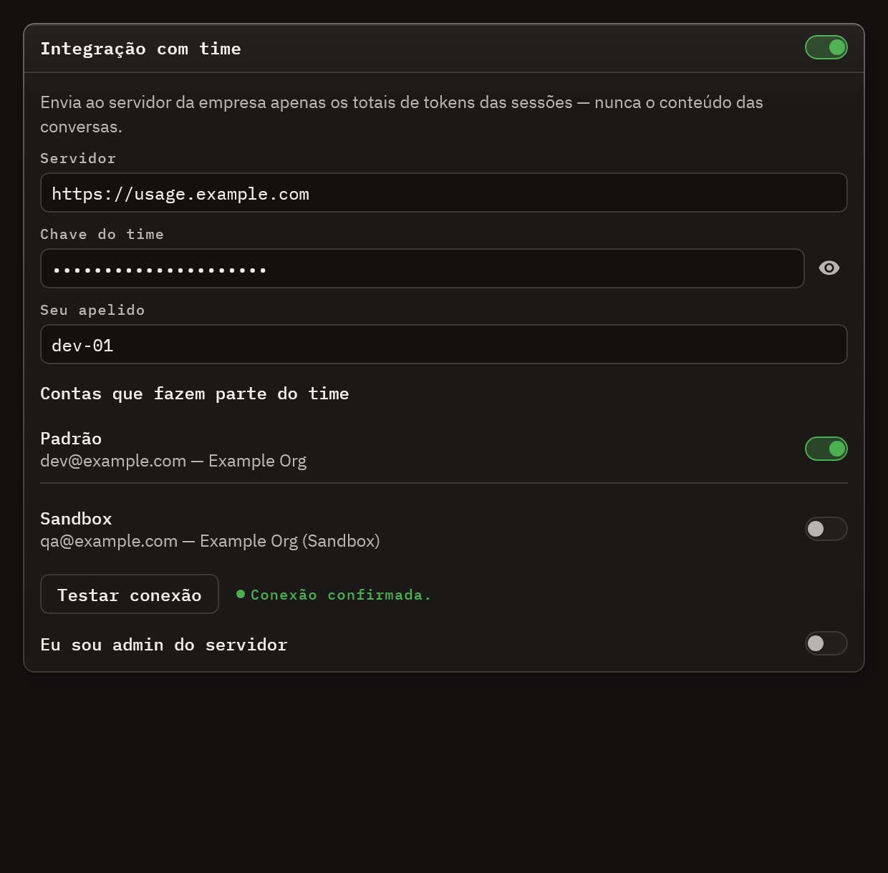

# Usage Monitor


Desktop app em Kotlin Multiplatform + Compose Desktop para acompanhar consumo, saldo e quotas de ferramentas/APIs de IA em um unico painel.

Hoje o projeto monitora integracoes remotas e locais, persiste historico em SQLite, oferece refresh automatico a cada 10 minutos, suporta reorder/minimizacao de cards, tema claro/escuro, idioma PT/EN, auto-start em Windows/Linux/macOS e verificacao de updates via GitHub Releases.

## Visao geral

- Dashboard unico para varias fontes de uso.
- Refresh automatico a cada 10 minutos.
- Refresh manual global ou por integracao.
- Estado parcial: se uma fonte falhar, as outras continuam a aparecer.
- Historico local com tendencia, consumo medio e forecast.
- Sessoes CLI do Claude Code por conta, com custo estimado, veredito de saude da
  sessao e atualizacao ao vivo.
- Creditos de uso da Anthropic (`extra_usage`) como terceira cota do card, na
  moeda real da conta.
- Integracao opcional com servidor de time self-hosted para ver o consumo
  agregado da mesma conta em varias maquinas.
- Janela de 5h ancorada no reset de quota da conta, tanto nos cards quanto nos
  filtros de sessao.
- Reordenacao e minimizacao de cards com persistencia local.
- Auto-start em Windows (registro `Run`), Linux (`.desktop` em autostart) e macOS (LaunchAgent).
- Verificacao de novas releases com banner manual e link para a pagina publicada no GitHub Releases.
- Sinalizador semaforo de risco de overage nos cards de uso.
- Aba Resumo nas Sessoes CLI: consumo da janela por projeto, por modelo e por
  branch, com ranking por custo e economia agregada do cache.
- Ritmo de queima em USD/h e tokens/h da janela corrente, com projecao de
  fechamento, e grade de atividade dia da semana x hora (BRT).
- Ranking das ferramentas mais chamadas na janela (Read, Bash, Edit...), por
  contagem de chamadas.
- Tendencia diaria do time nos ultimos 30 dias, uma faixa por integrante e todas
  na mesma escala (exige servidor 0.6.0+).
- Tempo ativo por sessao, descartando as pausas maiores que cinco minutos entre
  turnos.
- Exportacao de sessoes e do resumo em CSV ou JSON, seguindo a aba aberta e a
  janela escolhida.
- Orcamento mensal em USD com barra de consumo e projecao de fechamento. Os
  creditos de uso da Anthropic aparecem a parte, na moeda real da conta.
- Comparativo com o periodo anterior de mesma duracao no Historico.
- Icone na bandeja do sistema com ponto de risco e notificacao nativa quando uma
  cota cruza um limiar (75/90/100 por padrao) ou uma sessao CLI satura. Limiares,
  alerta de sessao e periodo de silencio configuraveis em Configuracoes > Alertas.
- Contagem regressiva de refresh persiste entre reinicios da app e avisa antes de um refresh manual.
- Modais de Historico e Configuracoes voltam ao topo automaticamente ao reabrir, mesmo se ficaram atras de outra janela.
- Scrollbar com contraste ajustado para o tema escuro.
- Modal de Configuracoes reorganizado em cartoes (Geral/Idioma, APIs monitoradas, Contas Anthropic).
- Opacidade da janela principal ajustavel entre 50% e 100% nas Configuracoes, com persistencia local.

## Screenshots

As imagens abaixo sao renderizadas offscreen a partir dos proprios componentes da
app, com dados sinteticos. Nenhuma conta, maquina ou chave real aparece nelas.
Para regerar depois de mudar a UI:

```bat
gradlew.bat generateScreenshots
gradlew.bat generateTourGif
```

O GIF do topo passeia por dashboard, historico, sessoes CLI, detalhe da sessao,
visao do time e configuracoes, na mesma ordem em que a app abre cada uma.

### Dashboard com varias contas

Um card por conta/integracao. O card Anthropic mostra as tres cotas — sessao 5h,
semanal e creditos de uso — com o semaforo de risco no canto da cota em perigo.



### Historico e previsao

Consumo ao longo do intervalo, com os reinicios de janela marcados, media por
hora e previsao de esgotamento.



### Sessoes CLI do Claude Code

Uma linha por sessao, com veredito de saude, custo estimado e filtros de janela.
O cabecalho conta quantas sessoes estao saturadas ou em atencao.



### Detalhe da sessao

Recomendacao de `/compact`, crescimento do contexto turno a turno e, no bloco
Avancado, composicao dos tokens, distribuicao do custo e economia do cache.



### Sessoes do time

Consumo agregado da conta por integrante: apelido, maquina, tokens, custo e
fatia do time. Cada integrante expande para as sessoes dele.



### Configuracoes



### Integracao com time

Servidor, chave, apelido e quais contas Anthropic participam.



## Integracoes suportadas

| Integracao | Tipo | Origem dos dados | Requisito local |
|---|---|---|---|
| Anthropic | Remota | `GET https://api.anthropic.com/api/oauth/usage` | `~/.claude/.credentials.json` |
| Codex | Remota | `GET https://chatgpt.com/backend-api/codex/usage` (5h legado) | `~/.codex/auth.json` e `~/.codex/cap_sid` |
| MiniMax | Remota | `GET https://www.minimax.io/v1/token_plan/remains` | `MINIMAX_API_KEY` |
| DeepSeek | Remota | `GET https://api.deepseek.com/user/balance` | `DEEPSEEK_API_KEY` |
| OpenCode Zen Free | Local | leitura de `~/.local/share/opencode/opencode.db` | base local do OpenCode existente |
| Kilo Free | Local | leitura de `~/.local/share/kilo/kilo.db` | base local do Kilo existente |

### Anthropic

- Descobre o perfil padrão `~/.claude`, o `CLAUDE_CONFIG_DIR` herdado no início da aplicação e diretórios `~/.claude-*` que contenham configuração Anthropic.
- Perfis adicionais também podem ser cadastrados manualmente em **Configurações > Contas Anthropic**. A aplicação apenas monitora: não executa login/logout e não remove arquivos de credenciais.
- O perfil padrão usa `~/.claude/.credentials.json` para o token e `~/.claude.json` para a identidade. Perfis personalizados usam `<CLAUDE_CONFIG_DIR>/.credentials.json` e `<CLAUDE_CONFIG_DIR>/.claude.json`.
- Novos perfis detectados ficam desabilitados até confirmação do usuário. Perfis habilitados aparecem simultaneamente, com um card por conta/workspace; caminhos duplicados e identidades duplicadas não geram coleta duplicada.
- Se o token estiver perto de expirar, `LocalCredentialDataSource` tenta refresh em `https://console.anthropic.com/v1/oauth/token`, com gravação atômica e proteção contra alteração concorrente do arquivo.
- No Windows, uma variável definida apenas com `$env:CLAUDE_CONFIG_DIR` afeta o PowerShell atual e seus processos filhos. O Usage Monitor usa os perfis cadastrados e não depende de ser aberto pelo mesmo terminal.
- A app trabalha com as janelas `five_hour` e `seven_day`.
- Headers obrigatorios:
  - `Authorization: Bearer <accessToken>`
  - `anthropic-beta: oauth-2025-04-20`
  - `User-Agent: claude-code/1.0.0`

### Codex

- Usa bearer token de `~/.codex/auth.json` em `tokens.access_token`.
- Usa tambem o cookie `cap_sid` lido de `~/.codex/cap_sid`.
- O endpoint legado do Codex alimenta apenas a quota 5h.
- A quota semanal depende de uma segunda fonte que ainda precisa ser descoberta e validada como HTTP reutilizável.

### MiniMax

- Le a chave exclusivamente da variavel de ambiente `MINIMAX_API_KEY`.
- A app filtra quotas do modelo `MiniMax-M*`.
- Nunca hardcode a chave.

### DeepSeek

- Le a chave exclusivamente da variavel de ambiente `DEEPSEEK_API_KEY`.
- O dashboard mostra saldo pago e, quando existir, saldo concedido.
- Os valores sao tratados em USD.

### OpenCode Zen Free

- Nao chama API HTTP.
- Le atividade observada da base local `~/.local/share/opencode/opencode.db`.
- Conta mensagens `assistant` do provider `opencode`.
- Agrupa uso nas janelas de 5h e 7d.
- Monitora modelos free como `*-free` e `big-pickle`.

### Kilo Free

- Nao chama API HTTP.
- Le atividade observada da base local `~/.local/share/kilo/kilo.db`.
- Conta mensagens `assistant` do provider `kilo`.
- Agrupa uso nas janelas de 5h e 7d.
- Monitora modelos free como `kilo-auto/free`, `*/free` e `*:free`.

## Requisitos

- Windows, Linux ou macOS para o fluxo principal da app desktop.
- JDK 17.
- Credenciais validas apenas para as integracoes que voce quiser habilitar.

### Variaveis de ambiente

```bat
set MINIMAX_API_KEY=your_key_here
set DEEPSEEK_API_KEY=your_key_here
```

Importante:

- Se a MiniMax estiver habilitada e `MINIMAX_API_KEY` nao existir, a app falha explicitamente.
- Se a DeepSeek estiver habilitada e `DEEPSEEK_API_KEY` nao existir, a app falha explicitamente.
- No macOS, app aberta pelo Finder nao herda `export` do shell. Defina as chaves com `launchctl setenv MINIMAX_API_KEY sua_chave` (vale ate reiniciar a sessao) ou abra a app pelo terminal.

### Ficheiros locais esperados

- Anthropic padrão: `~/.claude/.credentials.json` + `~/.claude.json`
- Anthropic no macOS: o Claude Code guarda o token na entrada `Claude Code-credentials` do Keychain; o ficheiro so existe como fallback. A app le o ficheiro quando ele existe e cai no Keychain caso contrario.
- Anthropic personalizado: `<CLAUDE_CONFIG_DIR>/.credentials.json` + `<CLAUDE_CONFIG_DIR>/.claude.json`
- Codex token: `~/.codex/auth.json`
- Codex cookie: `~/.codex/cap_sid`
- OpenCode: `~/.local/share/opencode/opencode.db`
- Kilo: `~/.local/share/kilo/kilo.db`

## Como rodar

Todos os comandos abaixo usam `gradlew.bat` no PowerShell:

```bat
gradlew.bat run
gradlew.bat desktopJar
gradlew.bat build
gradlew.bat allTests
gradlew.bat desktopTest
gradlew.bat desktopTest --tests "com.usagemonitor.domain.*"
gradlew.bat desktopTest --tests "com.usagemonitor.presentation.*"
gradlew.bat desktopTest --tests "com.usagemonitor.ui.*"
gradlew.bat createDistributable
gradlew.bat packageInstaller
gradlew.bat generateScreenshots
gradlew.bat clean
```

Observacoes:

- A task raiz `test` nao existe neste projeto KMP.
- Use `allTests`, `desktopTest` ou `build`.

## Como a app se comporta

### Dashboard

- Mostra um card por integracao habilitada.
- Permite refresh individual sem recarregar tudo.
- Persiste ordem dos cards e estado minimizado.
- Exibe banners persistentes para problemas de configuracao e updates disponiveis.
- Se pelo menos uma integracao responder, a UI permanece em sucesso parcial e lista os erros restantes.

### Historico

- Cada integracao pode abrir uma tela dedicada de historico.
- Intervalos disponiveis: `24h`, `7 dias`, `30 dias` e `Total`.
- O repositorio de historico calcula consumo acumulado, media por hora e forecast de esgotamento.
- O historico local fica em `~/.usage-monitor/usage-history.db`.
- Novos snapshots nao sao mais podados automaticamente; o filtro `Total` usa todo o historico ainda existente no banco local.

### Sessoes CLI

Cada card Anthropic abre a tela de **Sessoes CLI** daquela conta: uma linha por
sessao do Claude Code, lida dos transcripts locais em `~/.claude/projects`.

- Nao chama API. O indice fica em `~/.usage-monitor/usage-history.db`, alimentado
  por varredura incremental dos `.jsonl`.
- Filtros `5h` / `7 dias` / `30 dias` / `Total`. O recorte incide sobre os
  **turnos**: uma sessao antiga com atividade recente aparece com os numeros
  dessa atividade, nao com o total historico.
- A janela de 5h ancora no reset de quota da conta — a mesma que o card do
  dashboard mede — e nao nas ultimas cinco horas corridas.
- Atualizacao ao vivo a cada 5 segundos com a janela aberta.
- **Saude da sessao** na propria lista: `Saudavel`, `Atencao` ou `Saturada`,
  derivada do contexto vivo contra a janela do modelo. O cabecalho totaliza
  quantas pedem atencao. Sessao cujo modelo nao tem janela conhecida fica sem
  veredito em vez de receber um chute.
- O detalhe mostra o crescimento do contexto por turno e, no bloco Avancado, a
  composicao dos tokens, a distribuicao do custo e a economia gerada pelo cache.
- Custo estimado a preco de tabela (`ModelPricingTable`), nao e fatura.

### Integracao com time

Recurso **opcional**, desligado por default. Serve o caso em que a mesma conta Anthropic e usada por varios desenvolvedores em maquinas diferentes e a empresa quer ver o consumo agregado.

- Um servidor Node.js self-hosted (codigo em [`server/`](server/README.md)) recebe os turnos indexados de cada maquina e devolve a visao do time. A empresa opera esse servidor; nao ha servico gerenciado.
- Deploy pelo Dokploy com `Dockerfile.dokploy` na raiz (contexto `.`), compose em `docker/docker-compose.yml`. Passo a passo em [`server/README.md`](server/README.md).
- Em **Configuracoes -> Integracao com time**: ligar, informar servidor e chave, definir o apelido e marcar quais contas Anthropic participam.
- O card de cada conta marcada ganha um botao que abre **Sessoes do time**: uma linha por integrante (apelido, maquina, tokens, custo, fatia do time), expansivel para as sessoes daquele integrante.
- Mesmos filtros `5h` / `7 dias` / `30 dias` / `Total` da tela de Sessoes CLI, com a janela de 5h ancorada no mesmo reset de quota — os numeros do time fecham com os locais.
- Mesma cadencia de tempo real: leitura a cada 5s com a janela aberta; envio a cada 30s, independente da janela estar aberta.
- Cada envio reindexa os transcripts antes de sair, entao uma sessao nova aparece para os colegas em cerca de 35s no pior caso, mesmo com todas as janelas fechadas. Abrir a janela de Sessoes do time antecipa um envio na hora.
- O card ganha tambem um botao **Conectados agora**, que abre a lista de presenca em tempo real do time. Ela separa dois estados: **conectado** (o Usage Monitor esta aberto naquela maquina, confirmado por uma batida a cada 30s) e **trabalhando agora** (houve turno do Claude Code nos ultimos 5 minutos). Quem administra o servidor ve a mesma tela para todas as contas pelo botao da barra inferior.
- A presenca exige servidor **0.4.0 ou mais novo**. Contra um servidor anterior a app nao quebra: ela cai sozinha num envio so com o membro, que carimba o mesmo campo — a tela funciona igual, so sem a correcao de relogio.
- **Nao trafega conteudo de prompt nem de resposta.** So metadados de uso: id de sessao, id de mensagem, timestamp, modelo, contagem de tokens, diretorio do projeto, branch e nome da maquina.
- A chave do servidor fica em `~/.usage-monitor/team.json`, com permissao restrita ao dono — nao vai para as preferencias do registro.

### Update da app

- A app consulta a release mais recente em `edilsonvilarinho/usage-monitor`.
- Quando existe versao mais nova, a UI mostra um banner com a versao disponivel.
- O banner oferece acao para abrir a pagina da release publicada no GitHub.
- A verificacao roda na inicializacao, a cada 10 minutos e tambem no refresh manual.
- A app nao faz mais download, instalacao automatica nem restart por update em Windows ou Linux.

### Preferencias persistidas

Store local:

- `PreferencesSettings(Preferences.userRoot().node("com.usagemonitor"))`

Chaves persistidas:

- `enabledApis`
- `isDark`
- `language`
- `autoStart`
- `cardOrder`
- `minimizedCards`
- `windowOpacityPercent`
- `teamUsageWindow*` (geometria da janela de Sessoes do time)
- `teamPresenceWindow*` (geometria da janela de Conectados agora)

A configuracao da integracao com time **nao** entra aqui: vive em `~/.usage-monitor/team.json`, porque a chave do servidor e um segredo e as preferencias sao gravadas em claro no registro do Windows.

## Arquitetura

O projeto segue arquitetura em tres camadas com dependencia unidirecional:

`presentation -> domain <- data`

### Source sets

| Source set | Papel |
|---|---|
| `commonMain` | domain, data, presentation e UI partilhados |
| `desktopMain` | bootstrap desktop, datasources locais, SQLite, auto-start e update installer |
| `commonTest` | testes de domain, mappers, historico e ViewModels |
| `desktopTest` | testes de componentes Compose Desktop e datasources JVM |
| `src/installer` | scripts, idiomas e assets do instalador NSIS |

### Regras importantes

- `domain` nao pode importar Compose, Ktor ou infra.
- Entidades e contratos do dominio nao conhecem HTTP, JSON, ficheiros locais ou UI.
- Datasources que leem ficheiros do utilizador ficam em `desktopMain`.
- `DashboardViewModel` usa `SupervisorJob`.
- O polling roda em ciclo de 600 segundos.
- `viewModel.onDestroy()` precisa ser chamado ao fechar a janela.
- `Main.kt` fecha `DashboardViewModel`, `HistoryViewModel` e `HttpClient` no encerramento e no shutdown hook.

### Bootstrap e DI

O grafo e montado manualmente em `src/desktopMain/kotlin/com/usagemonitor/Main.kt`:

`HttpClient(OkHttp)` -> data sources locais/remotos -> repositories -> use cases -> `DashboardViewModel` / `HistoryViewModel` -> telas Compose

Dependencias principais do bootstrap:

- `LocalCredentialDataSource`
- `LocalCodexAuthDataSource`
- `LocalOpenCodeUsageDataSource`
- `LocalKiloUsageDataSource`
- `LocalUsageHistoryDataSource`
- `RemoteApiDataSource`
- `AnthropicRepositoryImpl`
- `MiniMaxRepositoryImpl`
- `CodexRepositoryImpl`
- `DeepSeekRepositoryImpl`
- `OpenCodeRepositoryImpl`
- `KiloRepositoryImpl`
- `UsageHistoryRepositoryImpl`
- `AppUpdateRepositoryImpl`
- `DesktopAppUpdateInstaller`

## Stack

- Kotlin Multiplatform
- Compose Multiplatform Desktop
- Ktor + OkHttp
- Kotlinx Serialization
- Kotlin Coroutines
- Kotlinx Datetime
- Multiplatform Settings
- SQLite JDBC
- NSIS

## Build e distribuicao

- `desktopJar` gera o JAR executavel.
- `createDistributable` gera a distribuicao desktop em `build/compose/binaries/main/app/Usage Monitor`.
- O projeto configura `TargetFormat.Exe`, `TargetFormat.Msi`, `TargetFormat.Deb`, `TargetFormat.Rpm` e `TargetFormat.Dmg`.
- `packageInstaller` empacota o instalador NSIS quando o NSIS estiver instalado.
- `build-with-icon.ps1` e um fluxo auxiliar Windows para gerar distributable, aplicar icone com `rcedit` e chamar o NSIS manualmente.
- `packageDmg` so roda em macOS: o jpackage nao faz cross-compile.
- A versao da app vem de `build.gradle.kts` e e propagada para `CURRENT_APP_VERSION`.
- Tags `v*` disparam `.github/workflows/release-linux.yml`, que publica artefatos Linux, Windows e macOS no GitHub Release. O job `verify` roda `allTests` em paralelo com os builds e `publish-release` depende dele: suite vermelha nao publica release.
- `.github/workflows/ci.yml` roda `allTests` em push para `main` e em pull request; `.github/workflows/ci-server.yml` roda `typecheck` e `vitest` do `server/` quando `server/**` muda.

### Instalacao no macOS

Os DMGs (`usage-monitor_X.Y.Z_macos_arm64.dmg` e `..._x64.dmg`) sao publicados **sem assinatura Apple**. Na primeira abertura o Gatekeeper bloqueia. Duas saidas:

- Clique com o botao direito no app dentro de `/Applications` e escolha **Abrir**, confirmando o aviso.
- Ou remova a quarentena: `xattr -dr com.apple.quarantine "/Applications/Usage Monitor.app"`.

O auto-start no macOS grava `~/Library/LaunchAgents/com.usagemonitor.app.plist` e carrega o agente com `launchctl`.

## Testes

- `commonTest` cobre domain, mappers, historico, forecast e ViewModels.
- `desktopTest` cobre datasources SQLite, componentes Compose e fluxo de update desktop.
- A suite agregada esperada do projeto e `gradlew.bat allTests`.

## Instalador NSIS

Licoes importantes ja validadas neste projeto:

- Use `SetCompressor zlib` no topo do `.nsi`.
- Evite launch bloqueante com `ExecWait` no fluxo de sucesso.

Sintomas conhecidos:

- Freeze em 99% costuma indicar problema de compressao LZMA.
- Freeze na tela final costuma indicar processo bloqueante.

## Regras de codigo

- Nomes em ingles, comentarios em portugues.
- Evitar nested scope functions como `let`, `apply` e `run`; preferir fluxo explicito.
- Componentes de UI devem ser stateless: dados por parametros, eventos por lambdas.
- `DashboardScreen` e o principal ponto stateful da UI.
- Preserve o comportamento de sucesso parcial do `UiState`.
- Nao hardcode segredos.

## Ficheiros relevantes

- `AGENTS.md`: regras operacionais do repositorio.
- `build.gradle.kts`: build, versao, distribuicao e tarefas do instalador.
- `src/desktopMain/kotlin/com/usagemonitor/Main.kt`: bootstrap, preferencias e composicao principal.
- `src/commonMain/kotlin/com/usagemonitor/presentation/viewmodel/DashboardViewModel.kt`: polling, refresh, snapshots e update flow.
- `src/commonMain/kotlin/com/usagemonitor/data/repository/UsageHistoryRepositoryImpl.kt`: agregacao historica e forecast.
- `src/commonMain/kotlin/com/usagemonitor/data/datasource/RemoteApiDataSource.kt`: chamadas HTTP remotas.
- `src/desktopMain/kotlin/com/usagemonitor/data/datasource/LocalObservedModelUsageReader.kt`: leitura das bases locais de OpenCode e Kilo.
- `src/installer/UsageMonitor.nsi`: script do instalador NSIS.
- `src/desktopMain/kotlin/com/usagemonitor/data/datasource/AnthropicCredentialStore.kt`: origem das credenciais Anthropic (ficheiro ou Keychain no macOS).
- `.github/workflows/release-linux.yml`: pipeline de release (Linux, Windows e macOS).
- `.github/workflows/ci.yml`: testes Kotlin (`allTests`) em push e pull request.
- `.github/workflows/ci-server.yml`: typecheck e testes do servidor de time.

## Convencao de commit

Antes de commitar:

```bash
git config user.name "codex"
git config user.email "codex@openai.com"
```

Depois de commitar, restaurar:

```bash
git config user.name "edilsonvilarinho"
git config user.email "edilson.vilarinho.messias@gmail.com"
```

Regra obrigatoria:

- Nunca rodar `git commit` ou `git push` sem pedido explicito do utilizador.
