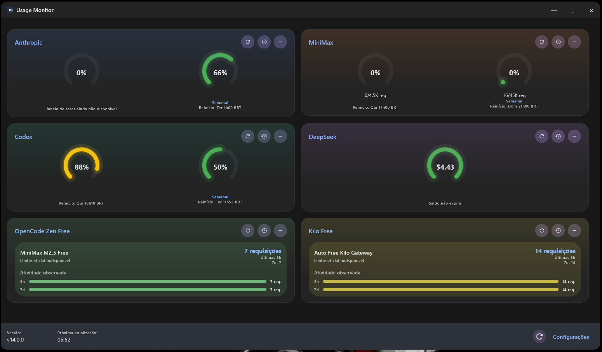
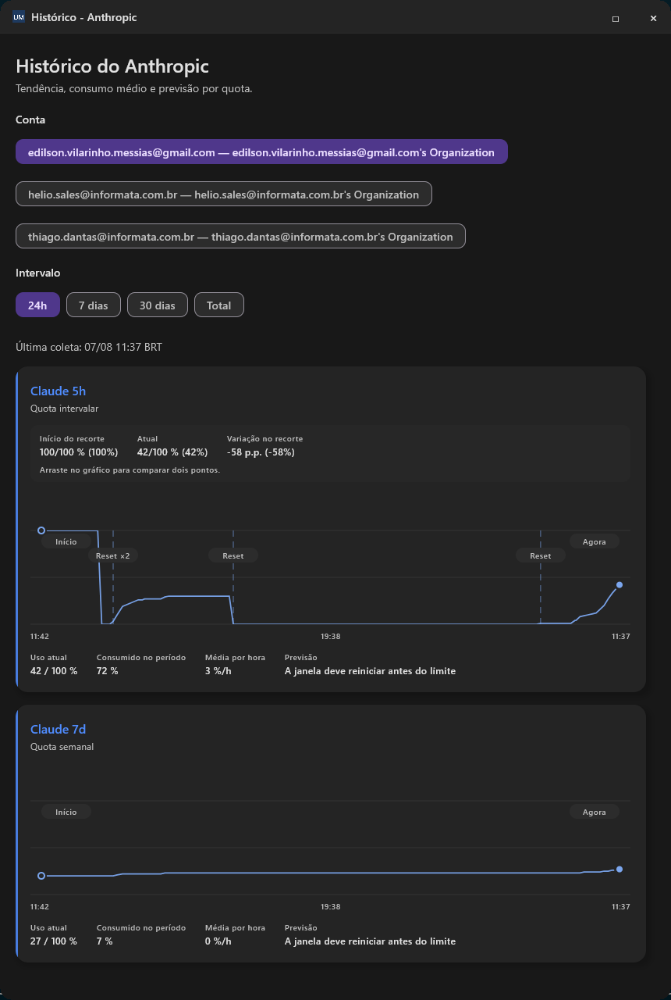
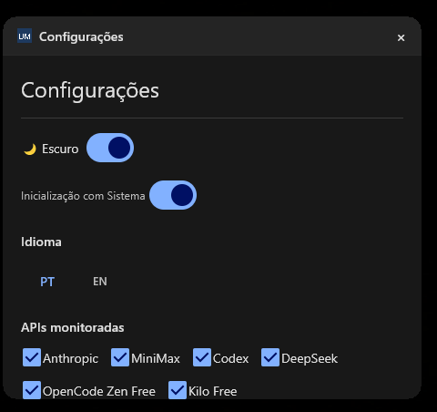

# Usage Monitor

Desktop app em Kotlin Multiplatform + Compose Desktop para acompanhar consumo, saldo e quotas de ferramentas/APIs de IA em um unico painel.

Hoje o projeto monitora integracoes remotas e locais, persiste historico em SQLite, oferece refresh automatico a cada 10 minutos, suporta reorder/minimizacao de cards, tema claro/escuro, idioma PT/EN, auto-start em Windows/Linux e verificacao de updates via GitHub Releases.

## Visao geral

- Dashboard unico para varias fontes de uso.
- Refresh automatico a cada 10 minutos.
- Refresh manual global ou por integracao.
- Estado parcial: se uma fonte falhar, as outras continuam a aparecer.
- Historico local com tendencia, consumo medio e forecast.
- Reordenacao e minimizacao de cards com persistencia local.
- Auto-start em Windows e Linux.
- Verificacao de novas releases e tentativa de instalacao automatica quando a plataforma suporta.

## Screenshots

### Dashboard



### Historico



### Configuracoes



## Integracoes suportadas

| Integracao | Tipo | Origem dos dados | Requisito local |
|---|---|---|---|
| Anthropic | Remota | `GET https://api.anthropic.com/api/oauth/usage` | `~/.claude/.credentials.json` |
| Codex | Remota | `GET https://chatgpt.com/backend-api/codex/usage` | `~/.codex/auth.json` e `~/.codex/cap_sid` |
| MiniMax | Remota | `GET https://www.minimax.io/v1/token_plan/remains` | `MINIMAX_API_KEY` |
| DeepSeek | Remota | `GET https://api.deepseek.com/user/balance` | `DEEPSEEK_API_KEY` |
| OpenCode Zen Free | Local | leitura de `~/.local/share/opencode/opencode.db` | base local do OpenCode existente |
| Kilo Free | Local | leitura de `~/.local/share/kilo/kilo.db` | base local do Kilo existente |

### Anthropic

- Usa bearer token de `~/.claude/.credentials.json` em `claudeAiOauth.accessToken`.
- Se o token estiver perto de expirar, `LocalCredentialDataSource` tenta refresh em `https://console.anthropic.com/v1/oauth/token`.
- A app trabalha com as janelas `five_hour` e `seven_day`.
- Headers obrigatorios:
  - `Authorization: Bearer <accessToken>`
  - `anthropic-beta: oauth-2025-04-20`
  - `User-Agent: claude-code/1.0.0`

### Codex

- Usa bearer token de `~/.codex/auth.json` em `tokens.access_token`.
- Usa tambem o cookie `cap_sid` lido de `~/.codex/cap_sid`.
- O mapper converte `primary_window` e `secondary_window` em quotas de 5h e 7d.

### MiniMax

- Le a chave exclusivamente da variavel de ambiente `MINIMAX_API_KEY`.
- A app filtra quotas do modelo `MiniMax-M*`.
- Nunca hardcode a chave.

### DeepSeek

- Le a chave exclusivamente da variavel de ambiente `DEEPSEEK_API_KEY`.
- O dashboard mostra saldo pago e, quando existir, saldo concedido.
- Os valores sao tratados em USD.

### OpenCode Zen Free

- Nao chama API HTTP.
- Le atividade observada da base local `~/.local/share/opencode/opencode.db`.
- Conta mensagens `assistant` do provider `opencode`.
- Agrupa uso nas janelas de 5h e 7d.
- Monitora modelos free como `*-free` e `big-pickle`.

### Kilo Free

- Nao chama API HTTP.
- Le atividade observada da base local `~/.local/share/kilo/kilo.db`.
- Conta mensagens `assistant` do provider `kilo`.
- Agrupa uso nas janelas de 5h e 7d.
- Monitora modelos free como `kilo-auto/free`, `*/free` e `*:free`.

## Requisitos

- Windows ou Linux para o fluxo principal da app desktop.
- JDK 17.
- Credenciais validas apenas para as integracoes que voce quiser habilitar.

### Variaveis de ambiente

```bat
set MINIMAX_API_KEY=your_key_here
set DEEPSEEK_API_KEY=your_key_here
```

Importante:

- Se a MiniMax estiver habilitada e `MINIMAX_API_KEY` nao existir, a app falha explicitamente.
- Se a DeepSeek estiver habilitada e `DEEPSEEK_API_KEY` nao existir, a app falha explicitamente.

### Ficheiros locais esperados

- Anthropic: `~/.claude/.credentials.json`
- Codex token: `~/.codex/auth.json`
- Codex cookie: `~/.codex/cap_sid`
- OpenCode: `~/.local/share/opencode/opencode.db`
- Kilo: `~/.local/share/kilo/kilo.db`

## Como rodar

Todos os comandos abaixo usam `gradlew.bat` no PowerShell:

```bat
gradlew.bat run
gradlew.bat desktopJar
gradlew.bat build
gradlew.bat allTests
gradlew.bat desktopTest
gradlew.bat desktopTest --tests "com.usagemonitor.domain.*"
gradlew.bat desktopTest --tests "com.usagemonitor.presentation.*"
gradlew.bat desktopTest --tests "com.usagemonitor.ui.*"
gradlew.bat createDistributable
gradlew.bat packageInstaller
gradlew.bat clean
```

Observacoes:

- A task raiz `test` nao existe neste projeto KMP.
- Use `allTests`, `desktopTest` ou `build`.

## Como a app se comporta

### Dashboard

- Mostra um card por integracao habilitada.
- Permite refresh individual sem recarregar tudo.
- Persiste ordem dos cards e estado minimizado.
- Exibe banners persistentes para problemas de configuracao e updates disponiveis.
- Se pelo menos uma integracao responder, a UI permanece em sucesso parcial e lista os erros restantes.

### Historico

- Cada integracao pode abrir uma tela dedicada de historico.
- Intervalos disponiveis: `24h`, `7 dias` e `30 dias`.
- O repositorio de historico calcula consumo acumulado, media por hora e forecast de esgotamento.
- O historico local fica em `~/.usage-monitor/usage-history.db`.
- A retencao atual e de 30 dias.

### Update da app

- A app consulta a release mais recente em `edilsonvilarinho/usage-monitor`.
- Em Windows, tenta preparar instalacao automatica a partir do asset `.msi`.
- Em Linux, a instalacao automatica exige `.deb`, `pkexec`, `dpkg` e instalacao previa via pacote DEB publicado.
- Em plataformas sem suporte automatico, a UI aponta para a release publicada.

### Preferencias persistidas

Store local:

- `PreferencesSettings(Preferences.userRoot().node("com.usagemonitor"))`

Chaves persistidas:

- `enabledApis`
- `isDark`
- `language`
- `autoStart`
- `cardOrder`
- `minimizedCards`

## Arquitetura

O projeto segue arquitetura em tres camadas com dependencia unidirecional:

`presentation -> domain <- data`

### Source sets

| Source set | Papel |
|---|---|
| `commonMain` | domain, data, presentation e UI partilhados |
| `desktopMain` | bootstrap desktop, datasources locais, SQLite, auto-start e update installer |
| `commonTest` | testes de domain, mappers, historico e ViewModels |
| `desktopTest` | testes de componentes Compose Desktop e datasources JVM |
| `src/installer` | scripts, idiomas e assets do instalador NSIS |

### Regras importantes

- `domain` nao pode importar Compose, Ktor ou infra.
- Entidades e contratos do dominio nao conhecem HTTP, JSON, ficheiros locais ou UI.
- Datasources que leem ficheiros do utilizador ficam em `desktopMain`.
- `DashboardViewModel` usa `SupervisorJob`.
- O polling roda em ciclo de 600 segundos.
- `viewModel.onDestroy()` precisa ser chamado ao fechar a janela.
- `Main.kt` fecha `DashboardViewModel`, `HistoryViewModel` e `HttpClient` no encerramento e no shutdown hook.

### Bootstrap e DI

O grafo e montado manualmente em `src/desktopMain/kotlin/com/usagemonitor/Main.kt`:

`HttpClient(OkHttp)` -> data sources locais/remotos -> repositories -> use cases -> `DashboardViewModel` / `HistoryViewModel` -> telas Compose

Dependencias principais do bootstrap:

- `LocalCredentialDataSource`
- `LocalCodexAuthDataSource`
- `LocalOpenCodeUsageDataSource`
- `LocalKiloUsageDataSource`
- `LocalUsageHistoryDataSource`
- `RemoteApiDataSource`
- `AnthropicRepositoryImpl`
- `MiniMaxRepositoryImpl`
- `CodexRepositoryImpl`
- `DeepSeekRepositoryImpl`
- `OpenCodeRepositoryImpl`
- `KiloRepositoryImpl`
- `UsageHistoryRepositoryImpl`
- `AppUpdateRepositoryImpl`
- `DesktopAppUpdateInstaller`

## Stack

- Kotlin Multiplatform
- Compose Multiplatform Desktop
- Ktor + OkHttp
- Kotlinx Serialization
- Kotlin Coroutines
- Kotlinx Datetime
- Multiplatform Settings
- SQLite JDBC
- NSIS

## Build e distribuicao

- `desktopJar` gera o JAR executavel.
- `createDistributable` gera a distribuicao desktop em `build/compose/binaries/main/app/Usage Monitor`.
- O projeto configura `TargetFormat.Exe`, `TargetFormat.Msi`, `TargetFormat.Deb` e `TargetFormat.Rpm`.
- `packageInstaller` empacota o instalador NSIS quando o NSIS estiver instalado.
- `build-with-icon.ps1` e um fluxo auxiliar Windows para gerar distributable, aplicar icone com `rcedit` e chamar o NSIS manualmente.
- A versao da app vem de `build.gradle.kts` e e propagada para `CURRENT_APP_VERSION`.
- Tags `v*` disparam `.github/workflows/release-linux.yml`, que publica artefatos Linux e Windows no GitHub Release.

## Testes

- `commonTest` cobre domain, mappers, historico, forecast e ViewModels.
- `desktopTest` cobre datasources SQLite, componentes Compose e fluxo de update desktop.
- A suite agregada esperada do projeto e `gradlew.bat allTests`.

## Instalador NSIS

Licoes importantes ja validadas neste projeto:

- Use `SetCompressor zlib` no topo do `.nsi`.
- Evite launch bloqueante com `ExecWait` no fluxo de sucesso.

Sintomas conhecidos:

- Freeze em 99% costuma indicar problema de compressao LZMA.
- Freeze na tela final costuma indicar processo bloqueante.

## Regras de codigo

- Nomes em ingles, comentarios em portugues.
- Evitar nested scope functions como `let`, `apply` e `run`; preferir fluxo explicito.
- Componentes de UI devem ser stateless: dados por parametros, eventos por lambdas.
- `DashboardScreen` e o principal ponto stateful da UI.
- Preserve o comportamento de sucesso parcial do `UiState`.
- Nao hardcode segredos.

## Ficheiros relevantes

- `AGENTS.md`: regras operacionais do repositorio.
- `build.gradle.kts`: build, versao, distribuicao e tarefas do instalador.
- `src/desktopMain/kotlin/com/usagemonitor/Main.kt`: bootstrap, preferencias e composicao principal.
- `src/commonMain/kotlin/com/usagemonitor/presentation/viewmodel/DashboardViewModel.kt`: polling, refresh, snapshots e update flow.
- `src/commonMain/kotlin/com/usagemonitor/data/repository/UsageHistoryRepositoryImpl.kt`: agregacao historica e forecast.
- `src/commonMain/kotlin/com/usagemonitor/data/datasource/RemoteApiDataSource.kt`: chamadas HTTP remotas.
- `src/desktopMain/kotlin/com/usagemonitor/data/datasource/LocalObservedModelUsageReader.kt`: leitura das bases locais de OpenCode e Kilo.
- `src/installer/UsageMonitor.nsi`: script do instalador NSIS.
- `.github/workflows/release-linux.yml`: pipeline de release.

## Convencao de commit

Antes de commitar:

```bash
git config user.name "codex"
git config user.email "codex@openai.com"
```

Depois de commitar, restaurar:

```bash
git config user.name "edilsonvilarinho"
git config user.email "edilson.vilarinho.messias@gmail.com"
```

Regra obrigatoria:

- Nunca rodar `git commit` ou `git push` sem pedido explicito do utilizador.
