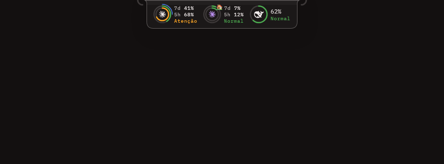
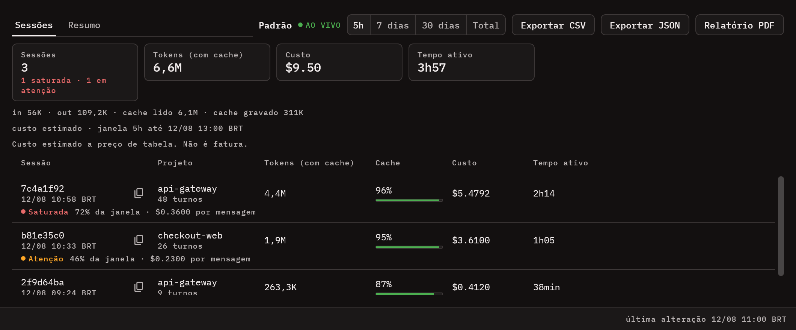
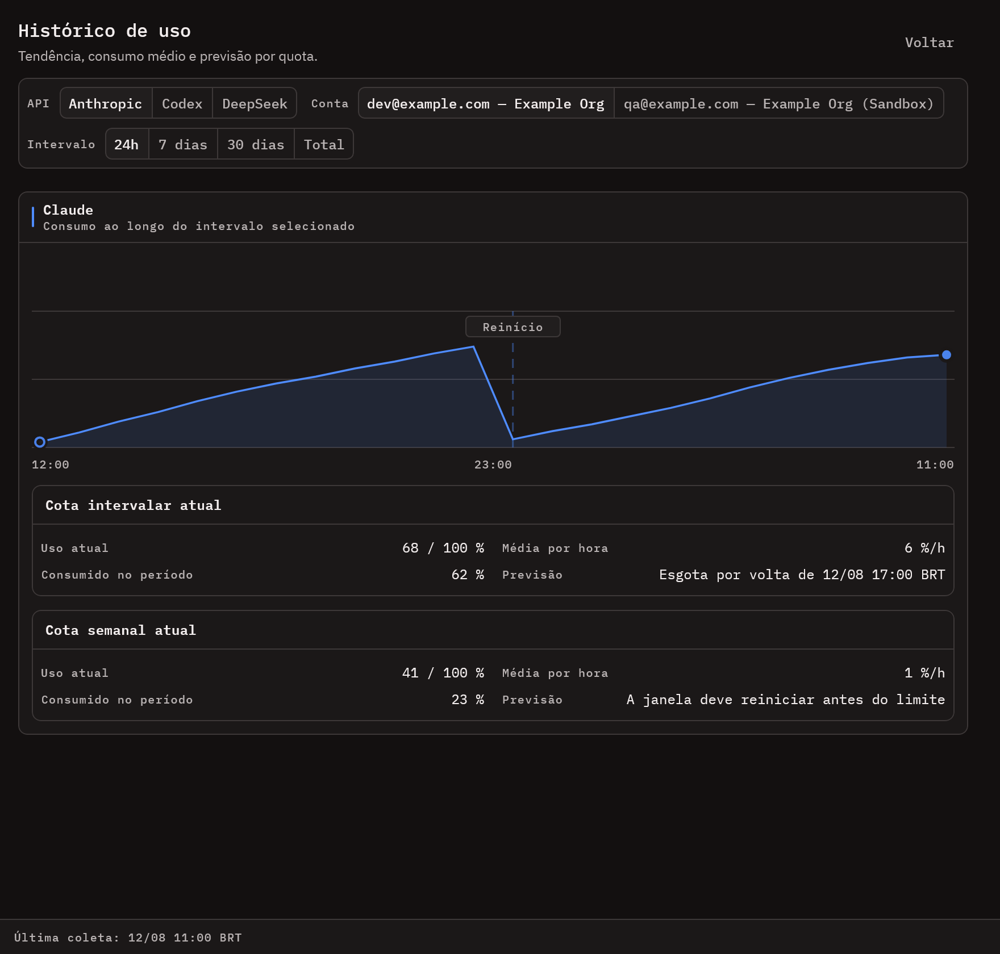
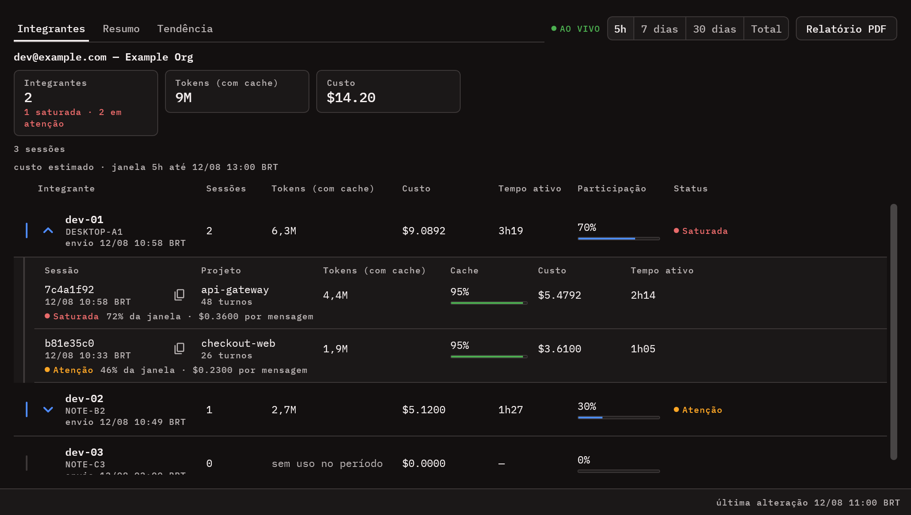
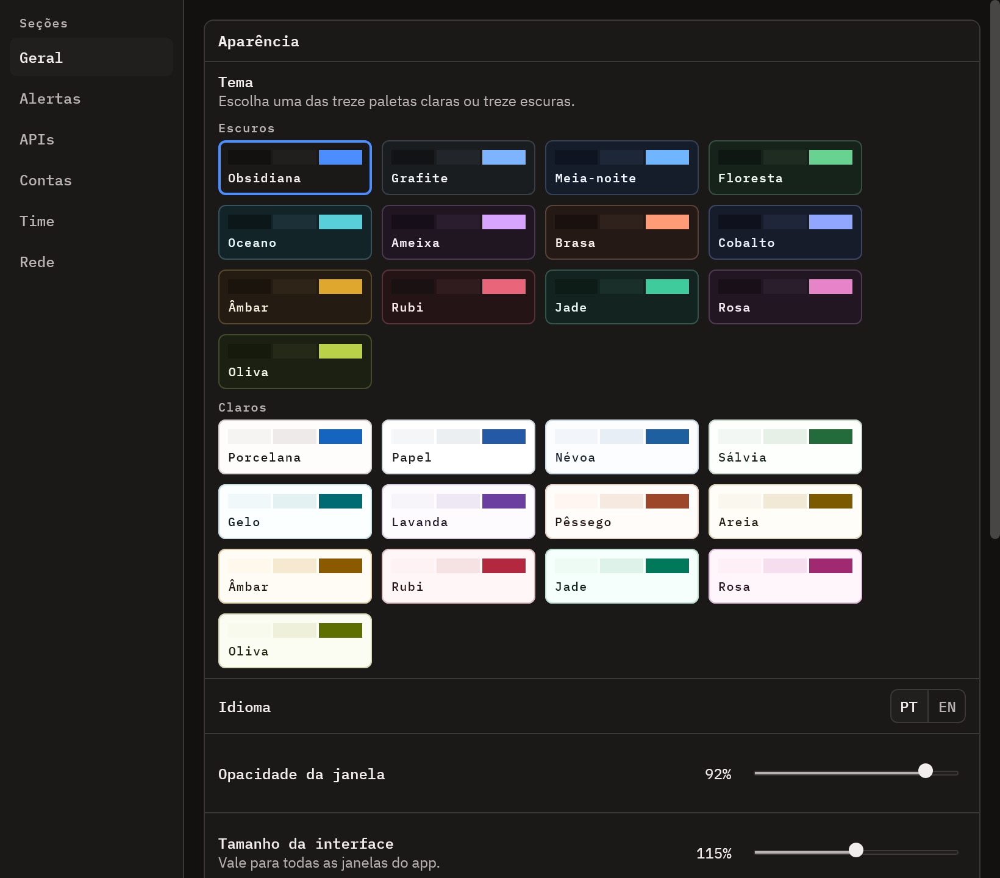

  

  
  
  
  
  

English · <a href="README.pt-BR.md">Português (Brasil)</a>

A desktop HUD for the quotas, usage and cost of every AI coding tool you pay for: **Claude Code**,
**Codex**, **MiniMax**, **DeepSeek**, **OpenCode Zen** and **Go**, **Kilo**, **OpenRouter**,
**Gemini CLI**, **Cursor** and **Antigravity CLI**.

A small notch docked to the edge of your screen shows one ring per account and one arc per quota.
It reads the credentials you already have, keeps history in local SQLite and never sends prompt or
response content anywhere.

## Features

- **HUD notch** — one ring per account, one arc per quota (weekly outside, 5h inside), docked to any
  edge of any monitor. Hover a ring for its details balloon; click it to refresh that account.
- **Claude Code session cost** — local transcripts broken down by session, project, branch and model,
  with estimated cost and a context-health verdict. Codex CLI sessions too, token counts only.
- **History and forecast** — summary before the chart, expandable quota and window details,
  projected exhaustion, previous-period comparison and a monthly USD budget.
- **Alerts** — tray notifications when a quota crosses 75/90/100% or a session saturates, with quiet
  hours.
- **Keeps working** — each source fails on its own and keeps its last reading; rate limits back off.
- **Export** — CSV and JSON of sessions and summaries, and PDF reports. History PDF follows the
  selected source, account, range and quota and includes all available windows, even when collapsed.
- **Team view (optional)** — a server you host aggregates one account across machines, with a 30-day
  trend and live presence. See [`server/README.md`](server/README.md).
- **Desktop** — auto-start, light and dark themes, English and Portuguese, UI scale, in-app help
  (`F1`) and self-update on Windows and Linux.

## Install

**[Download the latest release →](https://github.com/edilsonvilarinho/usage-monitor/releases/latest)**
The installers bundle their own Java runtime.

| Platform | Download | Self-updating |
|---|---|---|
| Windows | `UsageMonitor-Setup-X.Y.Z.exe` — per-user, no admin rights | Yes |
| Linux x64 | `install-usage-monitor_X.Y.Z_linux_x64.sh` — `sh ./install-…sh`, no `sudo` | Yes |
| Linux x64 | `usage-monitor_X.Y.Z_amd64.deb` / `usage-monitor-X.Y.Z.x86_64.rpm` | No |
| macOS | `usage-monitor_X.Y.Z_macos_arm64.dmg` (Apple silicon) / `_x64.dmg` (Intel) | No |

Claude Code and Codex are found on their own. MiniMax, DeepSeek, OpenCode Go and OpenRouter need an
API key, entered in **Settings > APIs**; environment variables are never read.

Platform notes

- **Windows, coming from the old MSI:** just run `UsageMonitor-Setup`. It removes the MSI install
  first; your data in `~/.usage-monitor/` survives. If that fails the installer stops and says so —
  uninstall the MSI from *Apps & features* and run it again.
- **Linux `.sh`:** installs under `$HOME` (XDG data dir plus `~/.local/bin/usage-monitor`), always
  checks the SHA-256, keeps the previous version for rollback and refuses to run over a `.deb`/`.rpm`
  install. Not supported: musl/Alpine, ARM64, Flatpak, AppImage.
- **macOS:** the DMGs are not signed by Apple. Right-click the app in `/Applications` and choose
  **Open**, or run `xattr -dr com.apple.quarantine "/Applications/Usage Monitor.app"`.

## Supported integrations

| Integration | Reads | Needs |
|---|---|---|
| Anthropic (Claude Code) | `/api/oauth/usage` | `~/.claude/.credentials.json` |
| Codex | `/backend-api/wham/usage` + local rollouts | `~/.codex/auth.json` and `~/.codex/cap_sid` |
| MiniMax · DeepSeek · OpenCode Go · OpenRouter | vendor usage/balance API | API key |
| OpenCode Zen Free · Kilo Free | local SQLite database | the tool already installed |
| Gemini CLI | `~/.gemini/tmp/*/chats/*.jsonl` | local session history (tokens only) |
| Cursor | `cursor.com/api/usage-summary` (undocumented) | a signed-in Cursor editor |
| Antigravity CLI | `agy --print /usage` | Antigravity CLI 1.2.9+, signed in |

Endpoints, credential paths and per-integration limits: [`docs/integrations.md`](docs/integrations.md).

## Privacy

- Credential files are **read only** — no login, logout or deletion.
- **No prompt or response content ever leaves the app.** The team integration sends usage metadata
  only: ids, timestamps, model, token counts, project directory, branch and machine name.
- Traffic goes only to the vendor APIs above and, if you set it up, to **your own** team server.

More screens

Rendered offscreen from the app's own components with synthetic data (`gradlew.bat generateScreenshots`).

## Reference guides

- [Integrations](docs/integrations.md) — every source: endpoints, credentials, known limits
- [Architecture](docs/architecture.md) — layers, source sets, dependency injection, storage
- [Build and release](docs/build-and-release.md) — building, packaging, CI and auto-update
- [Team server](server/README.md) — API contract and deployment
- [Contributing](CONTRIBUTING.md) · [Security](SECURITY.md) · [Changelog](CHANGELOG.md)

Issues and pull requests are welcome — start with [`CONTRIBUTING.md`](CONTRIBUTING.md).
[MIT](LICENSE) © 2026 Edilson Vilarinho
