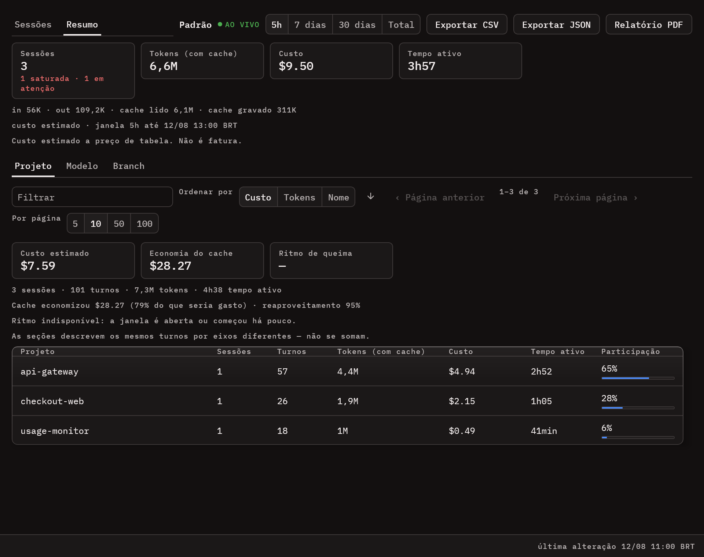
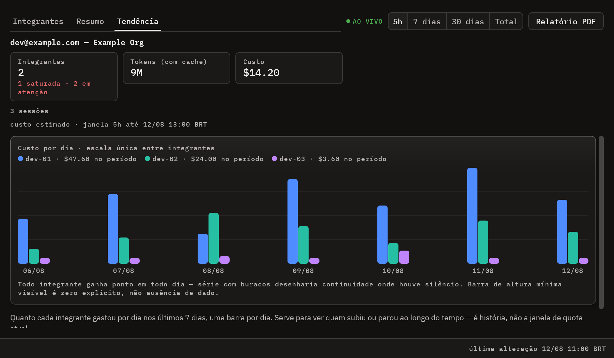
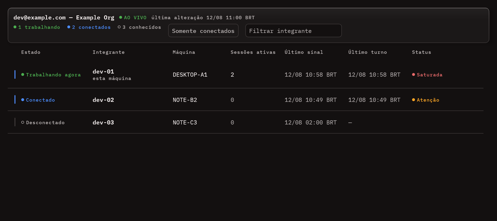
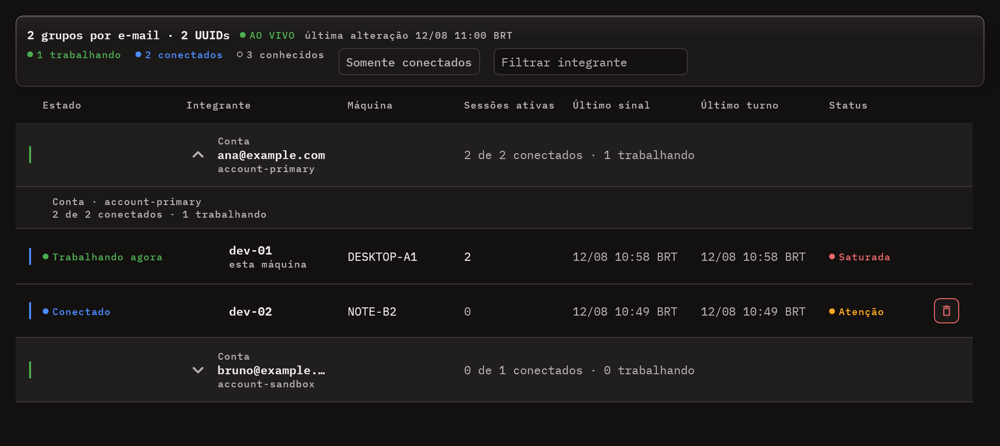
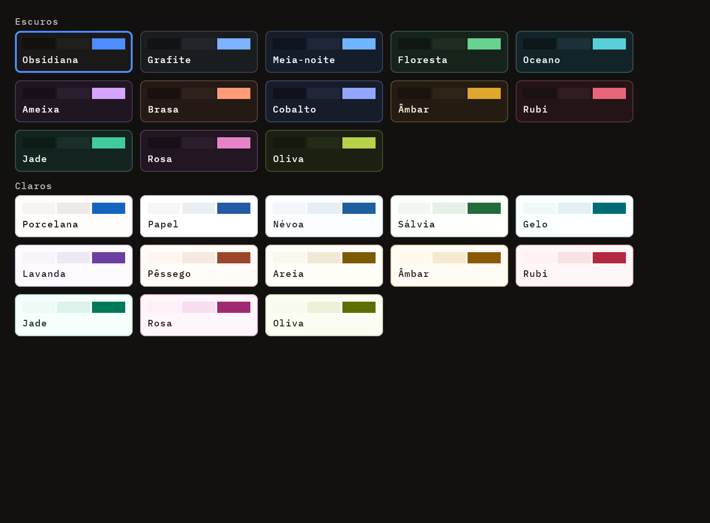
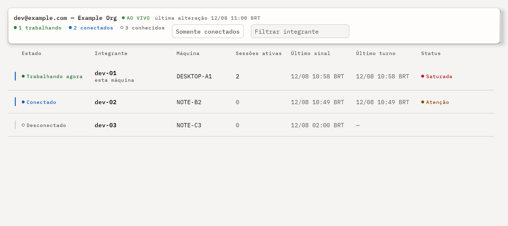

# Usage Monitor

**Um painel desktop para o consumo, as cotas e o custo de todas as ferramentas de IA que você paga.**

[](https://github.com/edilsonvilarinho/usage-monitor/actions/workflows/ci.yml)
[](https://github.com/edilsonvilarinho/usage-monitor/releases/latest)


[](LICENSE)

[English](README.md) · Português (Brasil)

> O [README em inglês](README.md) é o documento canônico. Esta tradução pode atrasar em relação a
> ele; em caso de divergência, vale o inglês.


O Usage Monitor acompanha oito fontes ao mesmo tempo — Claude Code, Codex, MiniMax, DeepSeek,
OpenCode Zen Free, OpenCode Go, Kilo Free e OpenRouter — e mostra cota, saldo e horário de reinício
de cada uma numa tela só. Ele também lê os **transcripts locais do Claude Code** para abrir o custo por sessão,
projeto, branch e modelo, guarda histórico em SQLite para tendência e previsão, e pode enviar o
consumo agregado para um servidor de time que você mesmo hospeda.

É uma aplicação desktop para Windows, Linux e macOS. Ela lê credenciais que você já tem, e nunca
envia conteúdo de prompt ou de resposta para lugar nenhum.

## Recursos

- **Dashboard unificado** — um card por fonte, refresh automático a cada 10 minutos, refresh manual
  por integração, cards reordenáveis e minimizáveis. Se uma fonte falhar, as outras continuam.
- **Custo das sessões do Claude Code** — uma linha por sessão, lida dos transcripts locais, com custo
  estimado, veredito de saúde da sessão e atualização ao vivo.
- **Resumo por eixo** — a mesma janela recortada por projeto, modelo, branch e ferramenta, com ritmo
  de queima em USD/h e tokens/h, grade de atividade dia da semana × hora, e tempo ativo que descarta
  as pausas maiores que cinco minutos.
- **Histórico e previsão** — histórico local em SQLite com tendência, média por hora, projeção de
  esgotamento, comparativo com o período anterior e orçamento mensal em USD.
- **Alertas** — ícone na bandeja com ponto de risco e notificação nativa quando uma cota cruza
  75/90/100% ou uma sessão satura. Limiares e período de silêncio configuráveis.
- **Exportação** — CSV e JSON de sessões e resumos, e relatório PDF do recorte que está na tela.
- **Visão de time (opcional)** — um servidor self-hosted agrega a mesma conta em várias máquinas, com
  tendência de 30 dias por integrante e lista de presença ao vivo.
- **Comportamento desktop** — auto-start nas três plataformas, tema claro e escuro, português e
  inglês, escala da interface de 80% a 150%, opacidade da janela ajustável, e atualização automática
  no Windows e no Linux.

## Integrações suportadas

| Integração | Tipo | Origem dos dados | Requisito local |
|---|---|---|---|
| Anthropic | Remota | `GET /api/oauth/usage` | `~/.claude/.credentials.json` |
| Codex | Remota | `GET /backend-api/wham/usage` | `~/.codex/auth.json` e `~/.codex/cap_sid` |
| MiniMax | Remota | `GET /v1/token_plan/remains` | chave informada em **Configurações > APIs** |
| DeepSeek | Remota | `GET /user/balance` | chave informada em **Configurações > APIs** |
| OpenCode Zen Free | Local | lê `~/.local/share/opencode/opencode.db` | base local do OpenCode existente |
| OpenCode Go | Remota | `GET /zen/go/v1/usage` | chave informada em **Configurações > APIs** |
| Kilo Free | Local | lê `~/.local/share/kilo/kilo.db` | base local do Kilo existente |
| OpenRouter | Remota | `GET /api/v1/credits` | chave informada em **Configurações > APIs** |

Endpoints completos, caminhos de credencial e limites de cada integração:
[`docs/integrations.md`](docs/integrations.md) (em inglês).

## Telas


Um card por conta ou integração. O card Anthropic mostra as três cotas — sessão de 5h, semanal e
créditos de uso — com o semáforo de risco na cota em perigo.


Uma linha por sessão do Claude Code, com veredito de saúde, custo estimado e filtros de janela. O
cabeçalho conta quantas sessões estão saturadas ou pedem atenção.


Consumo agregado por integrante: apelido, máquina, tokens, custo e fatia do time. Cada integrante
expande para as sessões dele.

<details>
<summary>Mais telas</summary>

**Histórico e previsão** — consumo ao longo do intervalo, com os reinícios de janela marcados, média
por hora e previsão de esgotamento.


**Resumo por eixo** — a mesma janela recortada por projeto, modelo, branch e ferramenta, com o ritmo
de queima e a grade de atividade. As listas descrevem os mesmos turnos: somar baldes de listas
diferentes contaria o mesmo gasto três vezes.



**Detalhe da sessão** — recomendação de `/compact`, crescimento do contexto turno a turno e, no bloco
Avançado, composição dos tokens, distribuição do custo e economia do cache.


**Tendência do time** — quanto cada integrante gastou por dia, uma barra por dia e uma cor por
pessoa, todas na mesma escala.



**Presença ao vivo** — quem está com a aplicação aberta e quem está de fato rodando o Claude Code
agora, como dois estados separados.



Quem administra vê a mesma tela para todas as contas:



**Configurações**, com navegação lateral em vez de uma coluna única de cartões.


**Temas** — toda tela é desenhada nos dois, a partir dos mesmos tokens.





</details>

As capturas são renderizadas offscreen a partir dos próprios componentes da aplicação, com dados
sintéticos. Nenhuma conta, máquina ou chave real aparece nelas.

## Instalação

**[Baixar a última release →](https://github.com/edilsonvilarinho/usage-monitor/releases/latest)**

| Plataforma | Artefato | Instalar | Atualiza sozinho |
|---|---|---|---|
| Windows | `UsageMonitor-Setup-X.Y.Z.exe` | executar — por usuário, sem admin | **Sim** |
| Linux | `install-usage-monitor_X.Y.Z_linux_x64.sh` | `sh ./install-usage-monitor_X.Y.Z_linux_x64.sh`, sem `sudo` | **Sim** |
| Linux | `usage-monitor_X.Y.Z_amd64.deb` | `sudo apt install ./usage-monitor_X.Y.Z_amd64.deb` | Não |
| Linux | `usage-monitor-X.Y.Z.x86_64.rpm` | `sudo dnf install ./usage-monitor-X.Y.Z.x86_64.rpm` | Não |
| macOS (Apple silicon) | `usage-monitor_X.Y.Z_macos_arm64.dmg` | abrir e arrastar para Applications | Não |
| macOS (Intel) | `usage-monitor_X.Y.Z_macos_x64.dmg` | abrir e arrastar para Applications | Não |

O `.exe` e o `.sh` são os únicos caminhos que se atualizam sozinhos. Prefira-os.

<details>
<summary>Windows — migração do MSI antigo</summary>

Até a v37 a release publicava também um `Usage Monitor-X.Y.Z.msi`, e os dois instaladores gravavam no
**mesmo** `%LOCALAPPDATA%\Usage Monitor`. O MSI saiu de circulação porque quem instalava por ele
ficava permanentemente fora da atualização automática.

**Quem está numa instalação MSI não precisa fazer nada.** Basta baixar o `UsageMonitor-Setup` e
executar: o instalador encontra o produto MSI anterior pelo UpgradeCode, o remove em silêncio e só
então grava a versão nova. Os dados ficam em `~/.usage-monitor/` e nas preferências do registro, fora
do diretório de instalação, e sobrevivem à migração.

Se a remoção automática falhar, o instalador diz que falhou e para, em vez de produzir uma instalação
dupla. Nesse caso a limpeza manual é:

1. Feche o Usage Monitor.
2. Desinstale o MSI em *Aplicativos e recursos* — a entrada cujo desinstalador é `MsiExec.exe` — ou
   por `msiexec /x {ProductCode}`.
3. Apague a chave órfã do instalador anterior, se ainda existir:
   `reg delete "HKCU\Software\Microsoft\Windows\CurrentVersion\Uninstall\Usage Monitor" /f`
4. Confira que `%LOCALAPPDATA%\Usage Monitor` sumiu; se sobrou, apague.
5. Instale o `UsageMonitor-Setup-X.Y.Z.exe`.
6. Reconfira *Iniciar com o Windows* nas Configurações.

</details>

<details>
<summary>Linux — o que o instalador user-space faz</summary>

O instalador `.sh` baixa o tarball da release (ou usa o arquivo local, se ele estiver ao lado),
**confere o SHA-256 sempre** e monta a árvore inteira dentro do `$HOME`:

```
<XDG_DATA_HOME>/usage-monitor/versions/<versão>/    uma árvore por versão retida
<XDG_DATA_HOME>/usage-monitor/current               arquivo de texto com a versão ativa
~/.local/bin/usage-monitor                          launcher estável
~/.local/share/applications/usage-monitor.desktop   entrada de menu
```

Ele **recusa a instalação** quando encontra um pacote `.deb`/`.rpm` já instalado ou um
`/opt/usage-monitor` — remova aquele antes. Se `~/.local/bin` não estiver no `PATH`, ele avisa; o
executável continua acessível pelo caminho completo e pela entrada de menu.

São cerca de 125 MB por versão, e ~600 MB em disco com duas versões retidas para rollback.
Fora do escopo: musl/Alpine, ARM64, Flatpak e AppImage.

</details>

<details>
<summary>macOS — Gatekeeper na primeira abertura</summary>

Os DMGs são publicados **sem assinatura Apple**, então o Gatekeeper bloqueia a primeira abertura.
Duas saídas:

- Clique com o botão direito no app dentro de `/Applications` e escolha **Abrir**, confirmando o
  aviso.
- Ou remova a quarentena:
  `xattr -dr com.apple.quarantine "/Applications/Usage Monitor.app"`

O auto-start no macOS grava `~/Library/LaunchAgents/com.usagemonitor.app.plist` e carrega o agente
com `launchctl`.

</details>

## Primeira execução

- **Claude Code e Codex não precisam de configuração.** O Usage Monitor encontra sozinho
  `~/.claude/.credentials.json` e `~/.codex/auth.json`. Perfis Anthropic recém-detectados ficam
  desabilitados até você confirmar, então nada é coletado sem que você saiba.
- **MiniMax, DeepSeek, OpenCode Go e OpenRouter precisam de chave de API**, informada em **Configurações > APIs**.
  As chaves ficam em `~/.usage-monitor/api-keys.json`, com escrita atômica e acesso restrito ao
  usuário. Variáveis de ambiente nunca são lidas.
- **OpenCode Zen Free e Kilo Free não precisam de nada** — leem as bases locais que essas ferramentas
  já mantêm.
- Histórico, índice de sessões e diagnósticos ficam em `~/.usage-monitor/`.
- O dashboard atualiza a cada 10 minutos. Fechar a janela encerra a aplicação; não existe minimizar
  para a bandeja.

Endpoints, caminhos de credencial e limites de cada integração:
[`docs/integrations.md`](docs/integrations.md) (em inglês).

## Visão de time (opcional)

Desligada por padrão. Serve o caso em que a mesma conta Anthropic é usada por vários desenvolvedores
em máquinas diferentes e a empresa quer ver o consumo agregado.

O servidor é operado pela sua empresa — não há serviço gerenciado. Cada máquina envia os turnos
indexados a cada 30 segundos e o servidor devolve a visão agregada, por integrante e por conta, com
tendência de 30 dias e lista de presença ao vivo. Configuração, contrato da API e deploy:
[`server/README.md`](server/README.md).


## Privacidade

- Os arquivos de credencial são **apenas lidos**. O Usage Monitor nunca executa login ou logout e
  nunca os apaga.
- **Nenhum conteúdo de prompt ou de resposta trafega.** A integração com time envia só metadados de
  uso: id da sessão, id da mensagem, timestamp, modelo, contagem de tokens, diretório do projeto,
  branch e nome da máquina.
- O tráfego de rede vai para as APIs listadas em [`docs/integrations.md`](docs/integrations.md) e, se
  você configurar, para o **seu próprio** servidor de time. Para nenhum outro lugar.
- A chave do time fica em `~/.usage-monitor/team.json`, com permissão restrita ao dono e
  deliberadamente fora das preferências, que são gravadas em claro.

## Requisitos

Windows, Linux (x86_64) ou macOS. Os instaladores já trazem o próprio runtime Java — não há nada mais
a instalar. Um JDK só é necessário para compilar a partir do código.

## Documentação

| Documento | O que cobre |
|---|---|
| [`docs/integrations.md`](docs/integrations.md) | cada fonte: endpoints, credenciais, limites conhecidos |
| [`docs/architecture.md`](docs/architecture.md) | camadas, source sets, injeção de dependências, armazenamento |
| [`docs/build-and-release.md`](docs/build-and-release.md) | build, empacotamento, CI e atualização automática |
| [`CONTRIBUTING.md`](CONTRIBUTING.md) | como preparar o ambiente, testar e enviar uma mudança |
| [`SECURITY.md`](SECURITY.md) | reportar vulnerabilidade e como as credenciais são tratadas |
| [`server/README.md`](server/README.md) | o servidor de time opcional: contrato da API e deploy |
| [`CHANGELOG.md`](CHANGELOG.md) | histórico de versões |

Notas internas de trabalho, em português: [`docs/design-system/`](docs/design-system/readme.md) (a
fonte de verdade visual) e [`docs/planos/`](docs/planos/) (planos de execução e registro de
decisões).

## Contribuindo

Issues e pull requests são bem-vindos. Comece pelo [`CONTRIBUTING.md`](CONTRIBUTING.md) — ele cobre o
build, a suíte de testes e as convenções de código. Para qualquer coisa ligada a segurança, leia
antes o [`SECURITY.md`](SECURITY.md).

## Licença

[MIT](LICENSE) © 2026 Edilson Vilarinho
