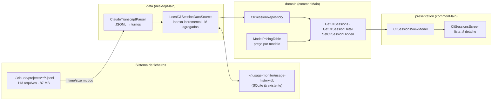
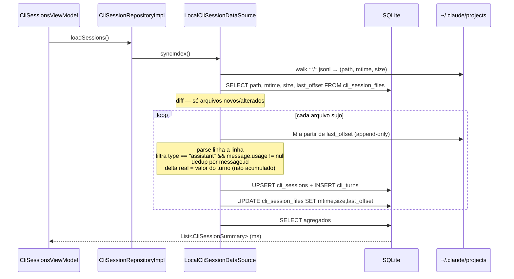
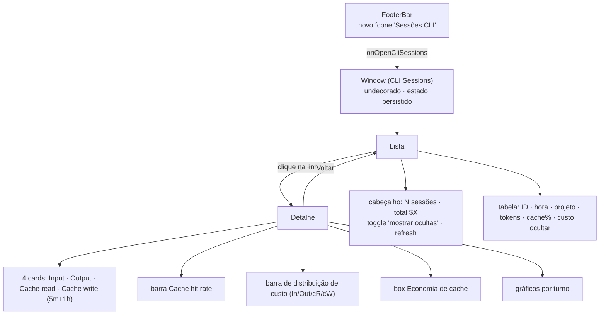

# Plano — Monitoramento de Sessões CLI (Claude Code)

> **Status:** aprovado, não iniciado. Retomar daqui na próxima sessão.
> **Fluxo visual (HTML):** https://claude.ai/code/artifact/2639feab-b5a3-471a-af75-fe6a8aa877d8
> **Legado de referência:** `C:\Users\edils\workspace\claude-usage-monitor` (Electron/TS, v22.0.0)
> **Medições feitas em:** 10/08/2026, nesta máquina.

---

## Context

O `usage-monitor` (KMP/Compose Desktop, v24.2.0) hoje monitora **cotas de API** (Anthropic, MiniMax, Codex, DeepSeek, OpenCode, Kilo) — percentual usado, reset, histórico. Ele não tem nenhuma visibilidade sobre **o que cada sessão do Claude Code CLI consumiu**: quantos tokens, quanto de cache, quanto custou, como o contexto evoluiu turno a turno.

O projeto legado tem exatamente isso — o modal "Sessões CLI" com lista, detalhe e Analytics. A tarefa é **incorporar a ideia**, usando o legado como inspiração, não como especificação.

Resultado esperado: uma janela "Sessões CLI" que lista as sessões do Claude Code com tokens/cache/custo, e um detalhe por sessão com KPIs, taxa de acerto de cache, distribuição de custo, economia gerada e gráficos por turno.

---

## O que o legado faz (evidência lida)

| Arquivo | Papel |
|---|---|
| `src/services/cliHookService.ts` | Instala `~/.claude/hooks/claude-usage-capture.js` e registra hooks `PostToolUse` + `Stop` em `~/.claude/settings.json`. O hook lê o transcript inteiro, soma todo `message.usage`, e faz `POST /sync/push` para `http://104.131.23.0:3030` com JWT. |
| `server/src/db/schema.sql:73` | Tabela `cli_usage_events(email, ts, session_id, tool_name, input/output/cache_read/cache_creation_tokens)`. |
| `server/src/routes/sync.ts:404` | `GET /sync/cli-sessions` — dedup por `session_id` pegando `MAX(ts)`. `GET /sync/cli-session-turns/:id` — todos os eventos ordenados. |
| `src/presentation/components/modals/CliSessionsModal.ts` | Lista (ID/hora/tokens/cache/custo), detalhe (4 cards, barra de hit rate, distribuição, box de economia). |
| `src/application/analyticsFormatter.ts` | `averageContextPerTurn`, `nextInteractionCost`, `cacheSavingsUSD`, `isSaturated`. |
| `src/presentation/components/charts/SessionAnalyticsCharts.ts` | 4 gráficos Chart.js: cache read/turno, cache create/turno, contexto médio/turno, custo × economia. |

Commits relevantes do legado: `2c38ae5` (modal), `ed8dea6` (redesign da lista), `d89c819` (módulo Analytics), `c6424a2` (gráfico de contexto), `2b3efb6` (histórico por turno), `b4a7a0f` (dedup por session_id).

### Defeitos técnicos do legado (corrigidos aqui)

1. **Rótulo "por turno" é mentira.** O hook re-soma o transcript inteiro a cada disparo e grava o total acumulado. Os gráficos são séries cumulativas, monotônicas — não por turno.
2. **Preços fixos de Sonnet** (`$3/$15/$0.30/$3.75`) aplicados a qualquer modelo. O transcript local mostra `claude-opus-5` em 176 de 176 mensagens — o custo exibido está subestimado.
3. **Ignora os tiers de cache.** O transcript separa `cache_creation.ephemeral_1h_input_tokens` de `ephemeral_5m_input_tokens`, que têm preços diferentes (2× vs 1,25× o input). O legado soma tudo num campo só.
4. **O(n²) de I/O.** Cada `PostToolUse` relê e re-parseia o arquivo inteiro. Numa sessão de 5,6 MB isso acontece centenas de vezes.
5. **Depende de hook + servidor + JWT.** Escreve em `~/.claude/settings.json` do usuário e manda dados de uso para um IP fixo. Desnecessário para um app desktop que roda na mesma máquina.
6. **Sidechain invisível.** Turnos de subagente (`isSidechain: true`) entram no total sem distinção.

---

## Fonte de dados: transcripts locais

Verificado em `C:\Users\edils\.claude\projects\`:

- **113 arquivos `.jsonl`**, 87,2 MB total, maior 5,6 MB, média 790 KB.
- Um arquivo por sessão: `<slug-do-cwd>/<sessionId>.jsonl`.
- Tipos de linha observados: `assistant`, `user`, `attachment`, `system`, `mode`, `permission-mode`, `last-prompt`, `ai-title`, `agent-name`, `file-history-delta`, `file-history-snapshot`, `queue-operation`.

Entrada `assistant` real (truncada):

```json
{
  "type": "assistant", "uuid": "75a33193-…", "parentUuid": "2441992e-…",
  "sessionId": "00c27c2e-4f2c-…", "timestamp": "…", "requestId": "req_011Cdtz…",
  "cwd": "C:\\Users\\edils\\workspace\\usage-monitor", "gitBranch": "main",
  "version": "2.1.226", "isSidechain": false,
  "message": {
    "id": "msg_011CdtzY19…", "model": "claude-opus-5", "stop_reason": "tool_use",
    "usage": {
      "input_tokens": 2, "output_tokens": 280,
      "cache_read_input_tokens": 18167, "cache_creation_input_tokens": 9633,
      "cache_creation": { "ephemeral_1h_input_tokens": 9633, "ephemeral_5m_input_tokens": 0 },
      "service_tier": "standard"
    }
  }
}
```

**Tudo que o legado buscava do servidor está aqui, com mais granularidade.** Zero hooks, zero servidor, zero JWT.

---

## Decisões (confirmadas pelo usuário)

| Decisão | Escolha |
|---|---|
| Superfície UI | Janela própria `Window` undecorada + `DesktopDialogFrame`, mesmo padrão do History |
| Leitura | Índice SQLite incremental em `~/.usage-monitor/usage-history.db` |
| Escopo | Apenas Claude Code (`~/.claude/projects`), com as métricas corrigidas |

### Não-decisão explícita: sem exclusão de dados

O legado tinha "Limpar tudo" e "✕" por linha porque apagava do **servidor dele**. Aqui a fonte é o transcript do Claude Code do próprio usuário — apagar significaria destruir o histórico do CLI. **Não haverá delete.** O botão vira **"Ocultar"**, gravando `hidden = 1` no índice; a sessão some da lista e o `.jsonl` fica intacto. Um toggle "mostrar ocultas" no cabeçalho reverte.

---

## Arquitetura

Respeita a regra do `CLAUDE.md`: `presentation → domain ← data`, domain sem imports externos, leitura de ficheiro só em `desktopMain`.



### Fluxo de indexação incremental



`last_offset` explora o fato de o `.jsonl` ser append-only: numa sessão ativa só o trecho novo é parseado. Se `size < last_offset` (arquivo truncado/recriado), reindexa do zero.

### Schema novo (mesmo DB, criado via `onOpen` do `SqliteConnectionManager`)

```sql
CREATE TABLE IF NOT EXISTS cli_session_files (
  path TEXT PRIMARY KEY,
  last_modified INTEGER NOT NULL,
  size_bytes INTEGER NOT NULL,
  last_offset INTEGER NOT NULL DEFAULT 0
);

CREATE TABLE IF NOT EXISTS cli_sessions (
  session_id TEXT PRIMARY KEY,
  file_path TEXT NOT NULL,
  cwd TEXT,
  git_branch TEXT,
  first_ts INTEGER NOT NULL,
  last_ts INTEGER NOT NULL,
  primary_model TEXT,
  turn_count INTEGER NOT NULL DEFAULT 0,
  input_tokens INTEGER NOT NULL DEFAULT 0,
  output_tokens INTEGER NOT NULL DEFAULT 0,
  cache_read_tokens INTEGER NOT NULL DEFAULT 0,
  cache_write_5m_tokens INTEGER NOT NULL DEFAULT 0,
  cache_write_1h_tokens INTEGER NOT NULL DEFAULT 0,
  cost_micros INTEGER NOT NULL DEFAULT 0,
  hidden INTEGER NOT NULL DEFAULT 0
);

CREATE TABLE IF NOT EXISTS cli_turns (
  session_id TEXT NOT NULL,
  seq INTEGER NOT NULL,
  message_id TEXT NOT NULL,
  ts INTEGER NOT NULL,
  model TEXT,
  is_sidechain INTEGER NOT NULL DEFAULT 0,
  input_tokens INTEGER NOT NULL DEFAULT 0,
  output_tokens INTEGER NOT NULL DEFAULT 0,
  cache_read_tokens INTEGER NOT NULL DEFAULT 0,
  cache_write_5m_tokens INTEGER NOT NULL DEFAULT 0,
  cache_write_1h_tokens INTEGER NOT NULL DEFAULT 0,
  PRIMARY KEY (session_id, message_id)
);

CREATE INDEX IF NOT EXISTS idx_cli_sessions_last_ts ON cli_sessions(hidden, last_ts DESC);
CREATE INDEX IF NOT EXISTS idx_cli_turns_session_seq ON cli_turns(session_id, seq);
```

Custo em **micros de USD** (`Long`) para evitar `Double` em agregação — segue o padrão de `cents` já usado em `UsageHistoryModels.kt`.

---

## Tabela de preços por modelo

Os quatro preços derivam da tarifa de input do modelo: cache read `0,1×`, cache write 5m `1,25×`, cache write 1h `2×`.

| Modelo | Input $/M | Output $/M | Cache read $/M | Cache write 5m $/M | Cache write 1h $/M |
|---|---|---|---|---|---|
| `claude-opus-5` | 5,00 | 25,00 | 0,50 | 6,25 | 10,00 |
| `claude-opus-4-8` / `4-7` / `4-6` / `4-5` | 5,00 | 25,00 | 0,50 | 6,25 | 10,00 |
| `claude-sonnet-5` | 2,00 | 10,00 | 0,20 | 2,50 | 4,00 |
| `claude-sonnet-4-6` / `4-5` | 3,00 | 15,00 | 0,30 | 3,75 | 6,00 |
| `claude-haiku-4-5` | 1,00 | 5,00 | 0,10 | 1,25 | 2,00 |
| `claude-fable-5` / `claude-mythos-5` | 10,00 | 50,00 | 1,00 | 12,50 | 20,00 |

`ModelPricingTable.forModel(id)` faz match por prefixo (tolera sufixos de data). Modelo desconhecido → `null`, e a UI marca o custo como estimado. **Nunca cai silenciosamente num preço errado como o legado.**

O custo é calculado **por turno com o modelo daquele turno** e somado — uma sessão que trocou de modelo no meio fica correta.

---

## UI



### Métricas do detalhe (semântica corrigida)

| Métrica | Legado | Aqui |
|---|---|---|
| Cache hit rate | `cacheRead / (cacheRead + cacheCreate)` | idêntico — a fórmula está certa |
| Custo efetivo | rates Sonnet fixos | Σ por turno com o preço do modelo do turno |
| Economia de cache | `cacheRead × (inputRate − cacheReadRate)` | idêntico, mas com as rates do modelo certo |
| Contexto médio/turno | `cacheReadTotal / nTurnos` (média de acumulado) | média aritmética dos `cache_read` reais por turno |
| Custo da próxima msg | `últimoTurno.cacheRead × cacheReadRate` | idêntico (o último `cache_read` é o tamanho do contexto vivo) |
| "Sessão saturada" | `custo > $0,05` **ou** `cacheRead > 150.000` | fração da janela de contexto do modelo. **Limiar exato precisa de calibração empírica** — entra como constante nomeada, não como número mágico espalhado. |

### Gráficos

3 gráficos `Canvas`. `UsageHistoryLineChart.kt` está acoplado a `UsageHistoryPoint`, então **não é reusável** — será um componente novo e enxuto, `TurnSeriesChart`, genérico sobre `List<Long>`.

1. **Contexto por turno** — `cache_read` real de cada turno. Mostra crescimento *e* as quedas de compactação, que a série cumulativa do legado escondia.
2. **Cache write por turno** — barras empilhadas 5m vs 1h.
3. **Custo acumulado × economia acumulada** — duas linhas.

---

## Arquivos

### Novos — `commonMain/domain`
- `entity/CliSessionModels.kt` — `CliSessionSummary`, `CliSessionTurn`, `CliSessionDetail`, `CliSessionAnalytics`
- `entity/ModelPricing.kt` + `ModelPricingTable.kt` — tabela acima, `forModel(id): ModelPricing?`
- `repository/CliSessionRepository.kt` — contrato
- `usecase/GetCliSessionsUseCase.kt`, `GetCliSessionDetailUseCase.kt`, `SetCliSessionHiddenUseCase.kt`
- `usecase/ComputeCliSessionAnalyticsUseCase.kt` — puro, testável, equivalente ao `analyticsFormatter.ts`

### Novos — `commonMain/data`
- `datasource/CliSessionDataSource.kt` — interface
- `dto/ClaudeTranscriptDto.kt` — `@Serializable` com `ignoreUnknownKeys = true`; campos: `type`, `sessionId`, `timestamp`, `cwd`, `gitBranch`, `isSidechain`, `message.{id,model,usage}`, `usage.{input_tokens,output_tokens,cache_read_input_tokens,cache_creation_input_tokens,cache_creation.{ephemeral_5m_input_tokens,ephemeral_1h_input_tokens}}`
- `repository/CliSessionRepositoryImpl.kt` — `Result.runCatching` como os demais repos

### Novos — `desktopMain`
- `data/datasource/LocalCliSessionDataSource.kt` — SQLite (reusa `SqliteConnectionManager`) + walk + parser incremental, tudo em `Dispatchers.IO`
- `CliSessionsWindowPreferences.kt` — cópia adaptada de `HistoryWindowPreferences.kt` (chaves `cliSessionsWindow*`)

### Novos — `commonMain/presentation`
- `viewmodel/CliSessionsUiState.kt`, `viewmodel/CliSessionsViewModel.kt` — `StateFlow`, `SupervisorJob`, `onDestroy()`, mesmo shape do `HistoryViewModel`
- `ui/CliSessionsScreen.kt` — stateless nos filhos, stateful só no topo
- `ui/components/TurnSeriesChart.kt` — Canvas genérico

### Modificados
- `desktopMain/Main.kt` — DI (datasource → repo → use cases → VM), `DisposableEffect` (fechar datasource), estado `isCliSessionsOpen`, novo bloco `Window` espelhando o de History (linhas 489-518), `LaunchedEffect` de persistência de janela
- `presentation/ui/DashboardScreen.kt` — novo parâmetro `onOpenCliSessions: () -> Unit`, repassado ao `FooterBar`
- `presentation/ui/components/FooterBar.kt` — terceiro `FooterIconActionButton` com tooltip PT/EN

### Testes
- `commonTest/.../domain/ModelPricingTableTest.kt` — match por prefixo, modelo desconhecido, derivação dos 5 preços
- `commonTest/.../domain/CliSessionAnalyticsTest.kt` — hit rate, economia, contexto médio, saturação, sessão sem cache (divisão por zero)
- `commonTest/.../presentation/CliSessionsViewModelTest.kt` — loading → success, erro, ocultar, refresh
- `desktopTest/.../data/LocalCliSessionDataSourceTest.kt` — fixtures `.jsonl` em `@TempDir`: sessão simples; append incremental (2ª passada só lê o delta); linha corrompida ignorada; `message.id` duplicado contado uma vez; troca de modelo no meio; truncamento → reindexa
- `desktopTest/.../ui/ComponentTest.kt` — smoke da lista e do detalhe via `runDesktopComposeUiTest`

---

## Riscos e mitigações

| Risco | Mitigação |
|---|---|
| Primeira indexação de 87 MB trava a UI | `Dispatchers.IO` + estado `Indexing(progress)` na tela; nunca no `Main` thread |
| Formato do `.jsonl` mudar entre versões do Claude Code | `ignoreUnknownKeys = true`; linha que falha o parse é ignorada e contabilizada num contador de `skippedLines` exposto em log, não quebra a sessão |
| Custo exibido diverge do faturamento real | Rótulo explícito "custo estimado a preço de tabela" + nota do modelo. Não é fatura. |
| Sessões antigas apagadas pelo Claude Code (retenção padrão 30 dias) | O índice mantém os agregados; sessão sem arquivo fica marcada `stale` e o detalhe por turno some, mas o resumo permanece |
| DB compartilhado com histórico de cotas | Tabelas com prefixo `cli_`, `CREATE TABLE IF NOT EXISTS` no `onOpen`, sem alterar tabelas existentes |

---

## Verificação

```bat
gradlew.bat desktopTest --tests "com.usagemonitor.domain.*"
gradlew.bat desktopTest --tests "com.usagemonitor.data.*"
gradlew.bat desktopTest --tests "com.usagemonitor.presentation.*"
gradlew.bat desktopTest --tests "com.usagemonitor.ui.*"
gradlew.bat run
```

Checklist manual com `gradlew.bat run`:

1. Botão novo no rodapé abre a janela; posição/tamanho persistem ao fechar e reabrir.
2. A lista traz as 113 sessões reais desta máquina, ordenadas por `last_ts` desc.
3. Conferir uma sessão contra o arquivo: somar `output_tokens` de todas as linhas `assistant` de um `.jsonl` e comparar com o total exibido.
4. Custo de uma sessão `claude-opus-5` deve ficar ~1,67× acima do que a fórmula Sonnet do legado daria — prova de que o preço por modelo está ativo.
5. Rodar o Claude Code numa sessão, apertar refresh: só o delta é lido (medir o tempo do 2º refresh; deve ser ordens de magnitude menor que o 1º).
6. Ocultar uma sessão → some da lista; toggle "mostrar ocultas" → reaparece; o `.jsonl` continua no disco (`Test-Path`).
7. Detalhe: gráfico de contexto por turno deve mostrar **quedas** onde houve compactação (o do legado nunca cai).

---

## Fora de escopo

- Codex / OpenCode / Kilo (a decisão foi Claude Code apenas)
- Hooks em `~/.claude/settings.json` e servidor de sync — substituídos por leitura local
- Exclusão de transcripts
- Sincronização em nuvem entre máquinas
